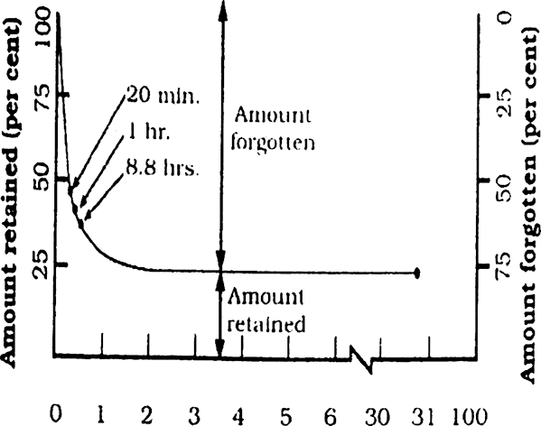

## Learning: Definition

*   **NCERT** Definition: Any **relatively permanent change** in behavior or behavioral potential **produced by practice and experience** is called learning.

*   **Calvin's** Definition: Learning is a modification in a ready-made behavior due to experience.

*   **Skinner's** Definition: Learning is the process of progressive behavior adaptation.

## Features of Learning

*   **Change in Behavior:** Learning leads to a change in behavior.
*   **Relatively Stable:** These changes are relatively stable (not always permanent).
*   **Internal & External Changes:** Changes can be both internal and external.
*   **Creative Synthesis:** Learning is a creative synthesis of knowledge and experience.

## Styles of Learning

*   Styles are methods used by learners to make learning easier and more interesting.
### Learning Styles derived from:

#### 1. Perceptual Modality:

*   Preference for receiving information.
*   Biologically based reaction to the physical environment
*   Examples: Visual, Auditory, Tactile learners.
#### 2. Information Processing:

*   How we think, solve problems, and remember information.
*   Serial vs. Simultaneous processing.
*   Active or reflective processing.
#### 3. Personality Pattern:

*   Preferred way of organizing, perceiving, and retaining information.
*   Focuses on how personality affects interaction with the environment and individual responses.
### Learning Styles (Anderson):

| Feature              | Relational Style (Arts)                 | Analytical Style (Science)         |
| -------------------- | --------------------------------------- | ---------------------------------- |
| Learning Approach    | Learns whole unit of information        | Learns information in small chunks |
| Thinking way         | Intuitive thinking                      | Sequential and structured thinking |
| Content Preference   | Human and Social content                | Inanimate and Impersonal content   |
| Memory Strength      | Verbal information                      | Abstract ideas                     |
| Task Orientation     | Non-Academic task-oriented              | Academic task-oriented             |
| Influence of Opinion | Influenced by authority opinion         | Not affected by opinions of others |
| Persistence          | Withdraws from non-stimulating tasks    | Persists in non-stimulating tasks  |
| School Style Match   | Conflicts with traditional school style | Matches mostly with school style   |

### Kolb's Learning Styles:

*   Four Styles based on a diagram with axes of Feeling, Watching, Thinking, and Doing.

|                                           | **Active Experimentation (Doing)**                                                                                                                                                                                                                                       | **Reflective Observation (Watching)**                                                                                                                                           |
| ----------------------------------------- | ------------------------------------------------------------------------------------------------------------------------------------------------------------------------------------------------------------------------------------------------------------------------ | ------------------------------------------------------------------------------------------------------------------------------------------------------------------------------- |
| **Concrete Experience (Feeling)**         | **Accommodating** (Feeling and Doing) Intuition-based,   Takes initiative and depends on trial and error rather than logic.  Uses analysis from others and Attracted to New Challenges and is the Most common in general public. Marketing, entrepreneurship | **Diverging** (Feeling and Watching) Prefers watching over doing,  Imagines solutions,  Works in groups,  Listens to ideas of others. Artist , Writer , Musician |
| **Abstract Conceptualization (Thinking)** | **Converging** (Thinking and Doing)  Interested in practical solutions,   Prioritizes technical tasks.  Engineer, Physician, Accountant                                                                                                                         | **Assimilating** (Thinking and Watching) Concise, Logical approach, Prioritizes ideas and concepts. Scientist, Professor                                                  |
## Memory

*   **Definition:** Ability to retain or recall information.
*   Psychological process of **retaining and recalling information over a period of time**.
*   Three Independent Stages:
    *   **Encoding:** Extracting meaning from information.
    *   **Storage:** Storing the encoded information for later use.
    *   **Retrieval:** Bringing stored information to awareness when needed.

### Memory Stages: Detailed

*   **Encoding:**
    *   Information is received and registered.
    *   Extract meaning so the memory system can reuse it.

*   **Storage:**
    *   Storing the encoded information so it can be used later.
    *   Retaining and holding information over a period of time.
    *   Completes the consolidation process of memory.

*   **Retrieval:**
    *   Bringing stored information to awareness.
    *   Used for performing various cognitive tasks.

### Models of Memory

#### 1. Stage Model of Memory (Atkinson & Shiffrin):

| Feature                 | Sensory Memory                            | Short-Term Memory (STM)                                                                       | Long-Term Memory (LTM) (Secondary Memory)        |
| ----------------------- | ----------------------------------------- | --------------------------------------------------------------------------------------------- | ------------------------------------------------ |
| **Function**            | Initial registration of sensory input     | Temporary storage and manipulation of information                                             | Permanent storage of information                 |
| **Duration**            | Less than 1 second                        | Less than 30 seconds                                                                          | Lifetime                                         |
| **Capacity**            | Large                                     | Limited (Information is lost if not practiced) Can be increased through chunking - Miller  | Unlimited                                        |
| **Encoding**            | Sensory-specific (visual, auditory, etc.) | Primarily acoustic (sound-based)                                                              | Semantic (meaning-based), visual, auditory, etc. |
| **Information Source**  | Direct sensory input                      | Attended information from sensory memory                                                      | Rehearsed/Elaborated information from STM        |
| **Key Processes**       | Registration                              | Attention, rehearsal, chunking                                                                | Encoding (elaboration, organization), retrieval  |
| **Replica of Stimulus** | Exact replica                             | Not exact; some processing occurs                                                             | Not exact; highly processed and organized        |

##### Control Processes of Memory (Atkinson & Shiffrin)
*   **Selective Attention:** Decides which information will travel from Sensory Memory to Short Term Memory.
*   **Maintenance Rehearsal (and Chunking):** Retains information in Short Term Memory for a longer time through repetition and through breaking into chunks of smaller sizes to better recall.
*   **Elaborative Rehearsal:** Moves information from Short Term Memory to Long Term Memory and deep thinking and memorizing.

#### 2. Working Memory Model (Tulving)

*   Working Memory Model divide long-term memory into two components:
    *   **Explicit Memory (Declarative Memory ):** Name , Fact, Event
	    *   **Episodic:** Memory of personal experiences (e.g., being scolded by mother, first day of school).
	    *   **Semantic:** General factual information (e.g., 2 + 4 = 6, Prime Minister of India).
    *   **Implicit Memory (Procedural Memory):** Processes
        *   Memory of learned skills (e.g., cycling, making tea).

#### 3. Bartlett Model of Memory:

*   Memory is an **active process** that changes according to one's prejudices, experiences, and requirements.
*   **Schema:** Organization of past experiences and knowledge that influences how incoming information is interpreted, stored, and retrieved.

#### 4. Craik & Lockhart's Levels of Processing Theory:

*   Two levels of processing determine memory retention:
    *   **Shallow Processing:**
        *   Attention to physical characteristics.
        *   Structural and phonological analysis.
        *   Short-term retention.
    *   **Deep Processing:**
        *   Interpretation at a deeper level.
        *   Semantic and elaborative analysis.
        *   Long-term retention.

## Forgetting 

*   **Definition:** The process of losing any previously learned experience or retained information due to some reason.
*   **Ebbinghaus's Forgetting Curve**: The amount of retention decreases as the time gap between learning and retention increases.

*   Equation: Amount Retained is inversely proportional to Time since learning.
*   Initially, there is a sharp decline in memory, but the rate of decline gradually slows down over time.

### Theories and Factors of Forgetting

*   **Decay or Disuse Principle (Ebbinghaus):** Memory traces formed during initial memory storage disappear over time due to lack of practice or use.
*   **Theory of Interference:** Associations established between different items interfere with each other during retrieval.
    *   **Proactive Interference:** Previously learned information interferes with the recall of **new information**.
    *   **Retroactive Interference:** New information interferes with the recall of **old information**.
*   **Encoding Failure:** Information is not properly encoded, making it difficult to retrieve.
*   **Consolidation Failure:** Encoded information is not consolidated, leading to failure of long-term memory formation.
*   **Retrieval Failure (Tulving):** The failure to use information stored in long-term memory in a timely manner due to the absence of retrieval cues. Retrieval cues helps us to retrieve stored information from our Long-Term-Memory.
*   **Motivated Forgetting (Freud):** Forgetting information that we want to forget due to anxiety or guilt (e.g., traumatic experiences like eve-teasing).

## Enhancing Memory

*   Techniques for improving memory.
*   *Mnemonic Devices:* Formal strategies used to enhance retention of information.
*   Examples:
    *   **Using Images:** Visual aids to help to remember information for longer.
	    * Keyword Method - memorised by learning keywords
	    * Method of Loci - info organised in  the form of image
    *   **Using Organization:**
        *   **Chunking:** Dividing information into smaller units and better memorizing (eg. Mobile Number ) .
        *   **First-Letter Technique:** Using the first letter of each word to create a memory aid (e.g., VIBGYOR).
    *   **Engaging in Deep-Level Processing:** 
	    * Given by Craik and Lockhart.
	    * Processing information at a deeper, semantic level.
	    * Ask questions about meaning and relations.
    *   **Minimizing Interference:** Avoiding learning too much similar information at once.
    *   **Moving Enough Retrieval Cues:** Using cues to prompt memory retrieval.
    *   **PQRST Method** : by Thomas and Robinson 
	    *  Preview - Cursory look at info
	    *  Question - Raising Questions from lesson 
	    *  Read - start reading and look for answer
	    *  Self- Recitation - 
	    *  Test - Memorise by writing 
	    

## Assessment of Motivation

	
* **Motivation** is the **drive or desire to pursue and achieve goals.**
* It involves internal and external factors that stimulate a person's interest, enthusiasm and persistence in pursuing a particular course of actions.

* **Assessment of motivation:** An attempt to assess the motivational elements or factors of a person.
*   Methods of Motivation Assessment:
    *   **Questionnaire Method:** Using questionnaires with questions to assess motivation levels (e.g., MMPI, 16PFQ).
    *   **Projective Techniques:** Using random or unstructured materials to assess motivation based on the individual's responses.
    *   **Analysis of Historical Events:** Obtaining information about social motives from newspapers and historical events.
    *   **Situational Test:** Presenting individuals with a situation and assessing their reactions.
    *   **Measurement of Activity Level:** Assessing motivation based on the intensity of an individual's responses and expressions.
    *   **Selection Method:** Assessing motivation based on the choices individuals make among available options.
    *   **Interference Method:** Assessing motivation by observing an individual's persistence in completing a task despite repeated failures.

