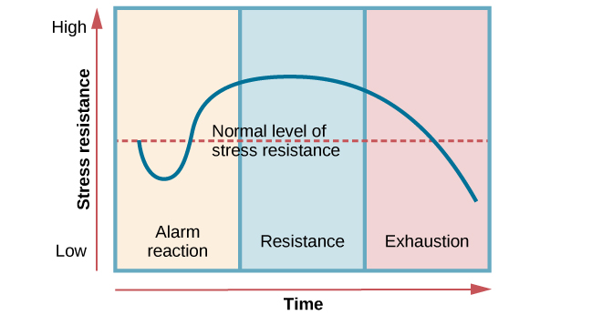

# Stress and Management
## Definition of Stress

*   A situation where capability is low and challenges are high.
*   Stress refers to **all those physical, emotional, cognitive, and behavioral changes that occur as a result of difficult and challenging situations which influences all aspects of individual behavior.**
*   Key point: Stress is like electricity - beneficial in moderation, but damaging in excess.

*   **Low Stress:** Can lead to listlessness, low motivation, and reduced performance.
*   **Stress Definition:** A pattern of responses to events that disrupt equilibrium and exceed coping abilities.

## Types of Stress

### 1. Hans Selye's Types of Stress

*   **Eustress:** Positive stress, short-term, motivates and energizes. Increases performance.
    *   Example: A player's stress during a game.

*   **Distress:** Negative stress, can be short-term or long-term, demotivates and creates anxiety. Decreases performance.
    *   Example: Divorce of parents, losing a loved one.

	*   Distress subtypes:
	    *   *Acute Distress:* Episodic, Short-term. High Intensity.
	        *   Example: Urgent task with the tyre punched
	    *   *Chronic Distress:* Toxic, Long-term, Less intense.
	        *   Example: Divorce, Financial problem.

### 2. Other Types of Stress

*   **Hyperstress:** Occurs when an individual is pushed beyond what they can handle.
	* Trigger strong emotiinal response
    *   Example: Work overload.

*   **Hypostress:** Opposite of hyperstress; occurs when an individual is bored and unchallenged.
    *   Example: Repetitive tasks.

### 3. Types of Stress (Based on Causes - According to NCERT)

*   **Physical Stress:** Demands that change the state of our body.
    *   Example: Poor nutrition, Injury, Lack of sleep.

*   **Environmental Stress:** Caused by environmental factors (often unavoidable).
    *   Example: Noise pollution, Crowds, Natural disasters.

*   **Social Stress:** Induced externally and results from interactions with other people.
    *   Example: Relationship problems, Disputes with neighbours.

*   **Psychological Stress:** Generated internally in the mind (internal source of stress).
    *   Example: Frustration, Conflict, Internal and Social pressure.

## Sources of Stress

*   Factors that cause stress are called **stressors**.
*   Three Basic Types:
    *   **Life Events:** 
	    * Major events that disrupt routine and cause turmoil.
        *   Example: Moving to a new house(planned), Breakup(non-planned).
    *   **Hassles:** 
	    * Annoying everyday events. 
        *   Example: Traffic problems, Water Shortage.
    *   **Traumatic Events:** 
	    * Extreme events that have a lasting impact.
	    * Needs professional help
        *   Example: Train accident, Robbery, Stuck In Tunnel.

## Signs and Symptoms of Stress

*   Divided into four categories:
    *   **Cognitive Symptoms:** Memory problems, Inability to concentrate, Poor judgment, Negative thinking.
    *   **Emotional Symptoms:** Extreme mood swings, Inability to relax, Fear, Depression, Sense of loneliness.
    *   **Physical Symptoms:** Headache, Dizziness, Chest pain, Rapid heartbeat.
    *   **Behavioral Symptoms:** Low self-esteem, Poor long-term planning, Inconsistency, Drug consumption.

## Effects of Stress

*   Divided into four categories:
    *   **Emotional Effects:** Mood swings, Irritability, Alienation from friends and family, Low confidence, Anxiety, Depression.
    *   **Physiological Effects:** Increased secretion of hormones (e.g., Adrenaline, Cortisol).
    *   **Cognitive Effects:** Mental overload, Loss of ability to make sound decisions, Lack of concentration, Reduced memory.
    *   **Behavioral Effects:** Excessive junk food consumption, Increased drinking/drug consumption, Affected sleep patterns, Reduced work performance.

## Nature of Stress

*   Three perspectives:
    *   **Stress as a Reaction:** Non-specific response of the body to any demand.
        *   **General Adaptation Syndrome (GAS) Theory (Hans Selye)**.
	        * Regardless of cause of threat, individual will respond with the same psychological pattern of reactions.
	        * Based on prolonged stress and similar response of individuals.
            *   Three Stages:
                *   *Alarm Reaction Stage*: Body releases hormones, (fear, fight, flight).
                *   *Resistance Stage*: Nervous system signals to use resources cautiously to cope with threat.
                *   *Exhaustion Stage*: Body's resources are drained, leading to high blood pressure and other diseases.
                
    *   **Stress as a Transaction  Process:** 
	    * Stress is **not an inherent factor in an individual or environment** but involves **individuals interacting with the environment**.
        *   Appraisals of Stress (**Lazarus- Faulkman**): Response to stressful situation depends on the perceived events and their appraisals.
            *   *Primary Appraisal:*
	            * Appraisal of causes of stress.
	            * Assessing the situation as positive, negative, or neutral.
	            * Negative events are appraised for their possible harm, threat or challenges.
            *   *Secondary Appraisal:*
	            * Appraisal of available resources.
	            * Assessing one's ability and resources to cope with the situation.
    *   **Stress as a Stimulus:**  (**Holmes and Rahe**): Stress is an independent variable and a cause of experience rather than the experience itself.

## Stress Management (Coping with Stress)

*   Coping is a **situation-specific reaction to stress.**
*   It is a set of concrete responses to stressful situations that one intended to resolve problem, to cope with the stress.

*   **Endler & Parker Theory:** Three strategies:
        * *Task-Oriented Strategy:*  Seeking to obtain information, analyse the stressful situation and finding alternate course of actions to cope up. Eg. Scheduling time table.
        * *Emotion-Oriented Strategy:* Managing stress by focusing on and reacting to emotions rather than addressing the situation directly. Eg.  expressing feelings, seeking emotional support.
        * *Avoidance-Oriented Strategy:* Seeking to avoid the situation by denying the seriousness of situation, suppression of stressful thoughts and their replacement by self protected thoughts . Eg. Watching TV

*   **Lazarus-Faulkman Theory** Two Strategies:
    *   **Problem-Focused Strategy:** 
	    * Attacking the problem itself.
	    * Increase awareness, level of knowledge along with a range of behavioural and cognitive stress coping options. Eg. make a plan of action and follow.
    *   **Emotion-Focused Strategy:** 
	    * Mainly for psychological changes
	    * Designed to limit the emotional disruption caused by an event.

## Stress Management Techniques

*   Techniques to reduce stress or deal with conditions that cause it (mental immunity).
*   **Examples:**
    *   **Relaxation Techniques:** Reduces stress, calms mind and relaxes Body. Eg.  Deep breathing, Pranayama, Muscle relaxation.
    *   **Meditation:** Altering the state of consciousness.
    *   **Biofeedback:** Developing awareness of physiological responses to stress and learning ways to control them. 
	    * Three stages-
            * Step 1: Developing and Awareness of Particular Physiological Response
            * Step 2: Learning Ways of Controlling Physio-Logical Responses
            * Step 3: Transferring These Controls Into Conditions of Everyday Life
    *   **Creative Visualization:** Using imaginary thoughts and ideas to achieve a specific goal. Process of subjective experience
    *   **Cognitive-Behavioral Techniques:** Inoculating people against stress through changes in behavior and thought patterns. Negative and irrational thoughts are replaces with positive and rational thoughts.
    *   **Exercise:** Improves heart and lung function, blood circulation, immunity.

## Promotion of Mental Health

*   Mental health is a **complete physical, mental, social, spiritual well-being, and not merely the absence of disease.**
*   People with a constructive attitude manage stress.
*   **Kubasa's findings on the characteristics of "Hardiness":**
	* People with high level of stress and low level of illness share 3 characteristics called personality trait of "Hardliness"
	    *   **Commitment:** Commitment to work, family, hobbies, social life.
	    *   **Control:** Sense of purpose and direction in life.
	    *   **Challenge:** Seeing challenges as positive and normal rather than threat.
*   **Life Skills:** *Skills that promote adaptive and positive behavior to effectively deal with demands*.
    *   **Assertiveness:** Ability to communicate feelings, needs, desires.  Such people have self confidence , high self esteem and solid sense of own identity.
    *   **Time Management:** Efficiently allocate time and resources to the prioritized Goals.
    *   **Rational Thinking:** Positive, realistic thinking removes anxiety.
    *   **Improving Relationships:** 
	    * Listening to what other person is saying , 
	    * Expressing what you feel and think.
	    * Accepting other's opinion even if they are different from ours.
    *   **Overcoming Unhelpful Habits:** Beating Perfectionism and Workaholic, Avoiding procrastination.

	*   **Social Support:** Existence and availability of people on whom one can rely.
	    *   *Tangible Support:* Provision of material help like Money or Resources.
	    *   *Informational Support:* Provision of helpful knowledge and information related to the stress and relevant resources.
	    *   *Emotional Support:* Provision of love and care, so you do not feel alone and dejected.

	*   **Other Factors:**
	    *   *Balance Diet*
	    *   *Exercise*
	    *   *Positive Attitude*
	    *   *Positive Thinking*