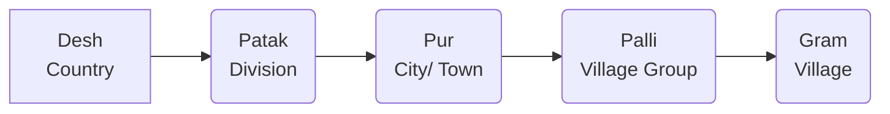
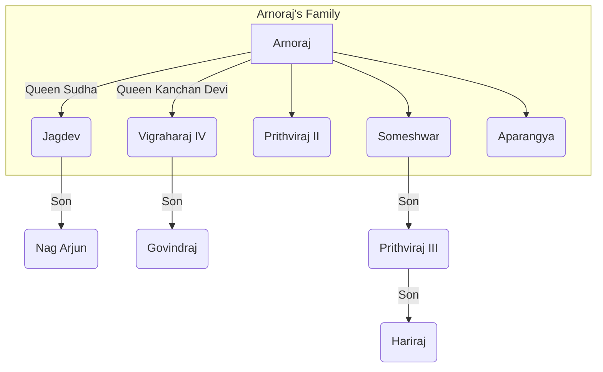

### The History of the Chauhans

## Origin

1.  **Agnivanshi Theory (Fire-Pit Theory)**
    *   According to Chand Bardai's book, *"Prithviraj Raso"* four Rajput clans were created from a fire-pit on Mount Abu by Sage Vashishtha.
        (i) Chauhan
        (ii) Chalukya (Solanki)
        (iii) Parmar
        (iv) Pratihar
    *   Later, Muhnot Nainsi and Suryamal Misran also supported this theory.

2.  **Suryavanshi:**
    *   *Prithviraj Vijay*
    *   *Hameer Mahakavya*
    *   *Hameer Raso*
    *   Ajmer Inscription of Vigraharaja IV
    *   Gaurishankar Hirachand Ojha
    *   *Surjan Charitra*
    *   *Chauhan Prashasti*

3.  **Chandravanshi:**
    *   Hansi Inscription (Haryana) - 1167 CE
    *   Achaleshwar Temple Inscription

4. **Brahmin:**
   * Bijoliya Inscription (Bhilwara) *(Vats Gotriya Brahmin)*
   * Chandravati Inscription (Sirohi)
   * Kayam Raso
    * Dashrath Sharma *(The Early Chauhan Dynasty)*
    * Gopinath Sharma (Based on Bijoliya Inscription)

5.  **Foreign:**
    *   James Tod (Saka/Scythian)
    *   William Crook (wrote the biography of James Tod)
    *   Smith

6. **Lineage of Indra**

*  Descendants of Indra mentioned in the *Sewari Inscription of Rao Pal* (Pali).

### 2. Bijolia Inscription (1170 AD), Bhilwara

This inscription was installed by a Digambara Jain named Loladu at the Parshvanath Temple. Key information from this inscription includes:

*   **Chauhan Dynasty Origin:**  The Chauhan dynasty is described as being of *Gautriya Brahmin* origin.
*   **Construction of Sambhar Lake:** Vasudev is credited with the construction of Sambhar Lake.
*   **Victory over Delhi:**  Vigraharaj II is mentioned as having conquered Delhi.
*   **Time of Installation:**  The inscription was installed during the reign of Someshwar.
*   **Donation of Rewana Village:**  Someshwar donated the village of "Rewana" to the temple.
*   **Title of Someshwar:** Someshwar is given the title "Pratap Lankeshwar" in this inscription.
*   **Religious Information:**  The inscription provides information about Shaivite and Jain pilgrimage sites.
*  **Ancient Names:**  Provides ancient names of cities and towns in Rajasthan
*   **Administrative Division:**  The inscription details the administrative division of the kingdom:

*   **Administrative Officials:** Information regarding administrative officials is present.
    *   **Pratihara Officer:** *Paristhiti*
    *   **Larger Unit Officer:** *Mahattar*
    *   **Village:**  *Gram*

*   **Ancient Names of Rajasthan Cities:**

| Current Name| Ancient Name |
| -----------| -----------|
| Bijolia | Vijayavalli|
| Harsol| Uttampuri|
| Nagda | Naghrada|
| Mount Abu | Mandukpur|
| Sambhar| Shakambhari|
| Nagaur| Ahichhatrapur|
| Nadol | Naddul |
| Bhinmal| Shrimal |
| Delhi | Dhillika |
| Jalore| Jabalipur|
   

*   **Administrative Division Summary (as per inscription):**
    Desh (Country) - Patak (Region) - Pur (City/Town) - Palli (Hamlet) - Gurugram (Village)
*   **Authors and Engravers:**
    *   **Composer:** Gunabhadra
    *   **Writer:** Keshav
    *   **Engraver:** Govind

### 3. Origin Place of the Chauhans

*   **Sapadlaksha:** The area around Sambhar Lake is considered the origin place of the Chauhans.
*  **Historian Ramkrishna Asopa's View:**  Initially, Chauhans resided around Sambhar Lake, according to historian Ramkrishna Asopa.
*   **Capital:** Ahichhatrapur (Nagaur). *Ahi* also means snake.
*   **Chauhan States/Principalities:**
    *  Sambhar / Ajmer
    *   Ranthambore
    *   Nadol
    *   Jalore
    *   Sirohi
    *   Bundi
    *   Kota

Okay, here's a structured and translated version of the notes on the history of the Chauhans of Sambhar/Ajmer, formatted in Markdown:

# History of the Chauhans of Sambhar/Ajmer

This section details the lineage and significant events of the Chauhan rulers of Sambhar/Ajmer.

## 1. Vasudev

*   **Establishment of the Chauhan Kingdom:** According to Rajshekhar's book 'Prabandh Kosh,' Vasudev established the Chauhan kingdom in Sambhar in 551 AD.
*   **Bijolia Inscription (1170 AD):**  States that he built Sambhar Lake and made Nagaur his capital.

## 2. Guvak I

*   **Feudal Status:** Initially, the Chauhans were vassals of the Gurjar Pratiharas.
*   **Title of 'Veer':**  Pratihara king Nagabhatta II (Jeenagal) gave him the title of 'Veer' (Brave).
*   **Independence:**  Later, Guvak refused to accept the Pratiharas' authority.
*   **First Independent Chauhan Ruler:**  He is considered the first independent Chauhan king.
*  **Harshnath Temple:** Guvak I built the Harshnath Temple, which is the *Kuldev* (family deity) of the Chauhans.

## 3. Chandraraj

*   **Queen Atmaprabha/Rudrani:** His queen, Atmaprabha/Rudrani, worshipped Lord Shiva at Pushkar Lake by lighting 1000 lamps.
*   **Expert in Yogic Practices:** She was skilled in yogic practices.

## 4. Vakpatiraj

*   **Victor of 108 Wars:** He is known as the victor of 108 wars.
*   **Establishment of Nadol:** His son, Lakshmanraj, established the Chauhan kingdom in Nadol (Pali).

## 5. Vigraharaj II

*   **Defeat of Mularaj I:** He defeated the Chalukya king of Gujarat, Mularaj I.
*   **Temple of Ashapura Mata:** He built the temple of their family deity, Ashapura Mata, in Bharuch (Gujarat).

## 6. Govind III

*   **Resistance against Ghazni:** According to historian Farishta, he prevented the king of Ghazni from invading Marwar.
*   **Alliance with Bhim I:** The Chalukya king of Gujarat, Bhim I, was also with him during this time.
*   **Title:** *Vairighata* (according to Prithviraj Vijay) which means 'Destroyer of Enemies'.

## 7. Durlabhraj III

*  **Confrontation with Ibrahim:** According to Dashrath Sharma, he faced the king of Ghazni, Ibrahim.

## 8. Vigraharaj III
*  **Defeat of Shahabuddin:** He defeated the king of Ghazni, Shahabuddin.

## 9. Prithviraj I

*   **Defeated Bagulisha:** Defeated the Muslim invader, Bagulisha.

## 10. Ajayraj (1105-1133 AD)

*   **Establishment of Ajmer:** Founded Ajmer in 1113 AD and built a fort there.
*   **Defeat of Gardat Matang:** Defeated Gardat Matang (king of Ghazni).
*   **Golden Kalash Gift:** Donated a golden kalash to the Parshvanath temple.
*   **Presided Over Debate:** He presided over a debate between the Digambara and Svetambara sects.
*   **Coinage:** Issued silver and copper coins in the name of his queen, Somaldevi/Sobhalekha, known as 'Ajayapriya Dramma'.
*   **Renunciation:** In his final days, he handed over power to his son, Arnoraj, and became a renunciate.

## 11. Arnoraj (1133-1155 AD)

*   **Defeat of Turks:** Defeated the Turks in 1135 AD and built the Anasagar Lake at the battle site.
*   **Varaha Temple:** Constructed the Varaha Temple (Lord Vishnu) in Pushkar.
*   **Defeated Naravarman:** He defeated the Malwa ruler Naravarman.
*   **Defeat of Jaysingh Siddharaj:** He defeated the Chalukya king of Gujarat, Jaysingh Siddharaj.
*   **Marriage Alliance:** Jaysingh Siddharaj married his daughter Kanchan Devi to Arnoraj.
*   **Defeat at Hands of Kumarapal:** He was defeated by the Chalukya king of Gujarat, Kumarapal, and married his daughter 'Jalhann Devi' to Kumarapal. After winning Ajmer, Kumarapal went to Chittorgarh.
*   **Mention in Literature:** This war is described in ‘Prabandh Chintamani’ and 'Prabandh Kosh.'
*   **Land Grant to Jain Sect:**  He gave land grants to the Kharataragachchha (Jain) sect.
*   **Court Scholars:** Devbodh, Dharmaghosh
*   **Murder:** He was killed by his son, Jagdev.

## 12. Jagdev

*   **Removal from Power:** He was removed from power by his brother, Vigraharaj IV.

## 13. Vigraharaj IV (1158-63 AD)

*   **Golden Age:** According to Dashrath Sharma, his reign was the golden age of the Chauhans of Ajmer.
*   **Defeat of Khusroshah:** According to 'Lalit Vigraharaj,' he defeated Khusroshah of Ghazni.
*   **Defeated Kumarapal:** He defeated Kumarapal Chalukya of Gujarat.
*   **Defeat of Tomar Rulers:** According to the Bijolia Inscription, he defeated the Tomar rulers of Dhillika (Delhi) and made them his vassals.
*  **Delhi Shivalik Pillar Inscription:** Installed the Delhi Shivalik Pillar Inscription. This inscription is written just below the Ashoka's Delhi Topra inscription (Haryana).
*   **Bisalpur Tank:** He constructed the Bisalpur Tank and built a pond and a Shiva temple there.
*   **Harkeli Drama:** He wrote the play 'Harkeli' (based on Bharavi's 'Kiratarjuniya').
*   **Ban on Animal Slaughter:**  He banned animal slaughter on Ekadashi day at the request of Dharmaghosh Suri.
*   **Saraswati Kanthabharan Pathshala:** Established the Sanskrit school 'Saraswati Kanthabharan' in Ajmer.  Lines from 'Harkeli' and 'Lalit Vigraharaj' were written on the walls of the school.
*   **Conversion to Mosque:**  Qutb-ud-din Aibak demolished this school and converted it into a mosque called 'Dhai Din ka Jhopra'.
*  **Urs of Peer Panja Shah:** An Urs (festival) of Peer Panja Shah is held for two and a half days near this mosque.
*   **Court Scholar:**
    *   Somdev: Author of 'Lalit Vigraharaj,' which narrates the love story of Vigraharaj and Desal Devi.
*   **Titles:**
    *   Bisaldev
    *   Kavi Bandhu (according to Prithviraj Vijay) or Kavi Valav (Udayabhatt)
*   **Comparison by Kilhorn:**  Kilhorn compared Vigraharaj to Kalidas and Bhavabhuti.

## 14. Aprangya

*   **Removal by Prithviraj II:** Removed by Prithviraj II.

## 15. Prithviraj II

*   **Palace in Hansi:** Built a palace in Hansi (Haryana) and appointed his maternal uncle, Chulhil Kalch, there.
    *   **Hansi Inscription (1167 AD):**
*   **Ghosunda Inscription:** According to the Ghosunda (Bhilwara) Inscription (1168 AD) of the Ruthi Rani Temple (Shiva Temple), he acquired it from his king, Bahul.
     * The inscription mentions the queen's name as Suhav Devi
*  **Suhveshwar Temple:** Built the Suhveshwar Temple (Shiva Temple) in Menal.

## 16. Someshwar

*   **Time in Gujarat:**  He spent much of his time in Gujarat.
*  **Defeat of Mallikarjuna:** Defeated Mallikarjuna, the king of Bahu Kantak, who was under Kumarapal.
*   **Queen:** Karpuri Devi (daughter of Chede King Achalraj Kalpuri).
*   **Vaidyanath Temple:** Built the Vaidyanath Temple in Sambhar and placed statues of Brahma, Vishnu, and Mahesh in it.
*   **Statues in Ajmer:**  Installed his own statue and that of his father, Arnoraj, in Ajmer.
*   **Title:** *Pratap Lankeshwar*.
*   **Bijolia Inscription:**  The Bijolia inscription was installed during his reign.

## 17. Prithviraj III (1177-92 AD)

*   **Father:** Someshwar
*   **Mother:** Karpuri Devi (Samritika)
*   **Ascension to Throne:** Became king at the age of 11.
*   **Chief Ministers:**
    *   Kadambvas/Kaimas
    *   Bhuvanmalla
    *   Skand
    *   Vaman
    *   Sodh

*   **Suppression of Rebellions:**  Suppressed the rebellions of his cousins, Nag Arjun and Aparangya.
    *  Nag Arjun had made Gurugram his main center
*  **Bhandanak Tribe:** In 1182 AD, he revolted against the Bhandanak tribe in the Mathura, Alwar, and Bharatpur regions. This information is obtained from the books of Jinpati Suri. The Bhandanak tribe had come from the Satluj region of Punjab and started living in the Gurugram Hisar regions.

*   **Battle of Mahoba/Tumul (1182 AD):**
    *   **Participants:** Prithviraj III vs. Parmadidev Chandela (Mahoba, M.P)
    *   **Cause:** Parmadidev Chandela had the wounded soldiers of Prithviraj III killed.
    *   **Outcome:** Prithviraj III won and made Panjaray the ruler of Mahoba.
    *  **Parmardidev's Commander:** Alha and Udal
*   **Battle of Nagaur (1184 AD):**
    *   **Participants:** Prithviraj III vs. Bhim II Chalukya (Gujarat).
    *   **Cause:** Both wanted to expand their empires. There was a long-standing enmity between the Chalukyas and the Chauhans.
    *   **Marriage Dispute:** Both wanted to marry the Paramara princess of Abu, Ikshni Devi, but Prithviraj married her.
   * **Peace Treaty:** Jagdev Pratihar mediated a treaty between them (Bhim-II's commander)

*   **Chauhan-Gahadwala Conflict:**
     * **Participants:** Prithviraj III vs. Jayachand (Kannauj).
    *   **Causes:**
        1. Succession to Delhi
        2.  Jayachand was helping Parmadidev against Prithviraj.
        3. Prithviraj kidnapped and married Jayachand's daughter, Sanyogita.
    * **Historical Acceptance** Dashrath Sharma accepted this love story as a historical fact (The early Chauhan Dynasty)

*   **First Battle of Tarain (1191 AD) (Haryana):**
    *   **Participants:** Prithviraj III vs. Ghori (Ghazni).
    *   **Causes:**
        1. Ghori had captured Tabarhinda (Bhatinda).
        2.  Long-standing enmity between the Chauhans and the kings of Ghazni.
    *   **Outcome:** Prithviraj III won and captured Jiauddin.
    *   **Govindraj Tomar's Role:**  Govindraj Tomar of Delhi had injured Ghori.

*   **Second Battle of Tarain (1192 AD):**
    *   **Participants:** Prithviraj III vs. Ghori
    *   **Outcome:** Ghori won.
   *  **Capture and Death:** Prithviraj was arrested near Sirsa at a place called Saraswati and was killed.
     * **Rule under Ghori** According to Hasan Nizami, Prithviraj ruled under Ghori for some time.
     * **Hasan Nizami's Book:** 'Taj-ul-Masir'
    *   **Reasons for Prithviraj's Defeat:**
        *   Disputes with neighboring kingdoms prevented them from assisting him against Ghori.
        *  Prithviraj gave Ghori enough time to prepare for the war after the first battle of Tarain.
        *  Prithviraj's army was smaller than Ghori's in the second battle of Tarain, and most of his commanders were busy in other border areas.
        *   Ghori was a skilled commander and defeated Prithviraj with his diplomacy.
        *   The Turkish army used horses, while the Rajputs used elephants.
        *   The Turks used lighter weapons than the Rajputs.

*   **Significance of the Battle of Tarain:**
    *   **Easy Rule for Ghori:** Prithviraj's defeat made it easier for Ghori's successors to rule in India.
    *   **Foundation of Turkish Rule:**  The foundation of Turkish rule was laid in India.
    *   **End of Rajput Ambitions:** The defeat of the Rajputs ended their political ambitions, and no Rajput king could gain control over Delhi after Prithviraj.
    *   **Foreign Rule:** After the second battle of Tarain, the period of foreign rule started in India, which continued till 1947 AD.
    * **Impact of Turkish Rule:**
      *  A. Positive Effects -
           * Rise of Sufi-Islamic governance in India that was reflected in Architecture, literature, music, painting etc
           * Sufi and Bhakti movement started in India.
      *  B. Negative Effects -
           *   Many invaders destroyed Hindu temples and Buddhist monasteries, leading to the decline of art and culture.
           * Buddhist culture almost disappeared from India after 1200 AD.
           *  The Turks destroyed educational centers, leading to the decline of the education system.

## 18. Cultural Achievements of Prithviraj

*   **Department of Art and Culture:** Established a department of art and culture.
     * Minister - Padmanabh
*   **Pithoragarh Fort:** Built the Pithoragarh fort (Delhi).
*   **Court Scholars:**
    1. Chandrabardai (Prithvibhatt) - *Prithviraj Raso*
    2. Jayanak - *Prithviraj Vijaya*
    3. Vagishwar Janardan
    4. Vidyapati Gaud
    5. Vishwaroop
    6. Ashadhar
*   **Titles:**
    *   Rai Pithora
    *   Dalpangul
*   **Assessment of Prithviraj Chauhan:**
    *   Accused of being an immature military leader and an unvisionary king, but this is not correct.
    *   He did not face defeat in any war before the Second Battle of Tarain, hence he cannot be called an immature military leader.
    *   The Indian culture of that time included not attacking the enemy's fleeing army and releasing the enemy after they had asked for forgiveness, and Prithviraj Chauhan was also following these ideals.
    *   Although the Turkish defeat paved the way for India's slavery, his importance in medieval Indian history cannot be ignored.

## 19. Govindraj

*   **Acceptance of Turkish Rule:** He accepted Turkish rule.  His uncle, Hariraj, removed him from power.
*  **Establishment of Ranthambore:** He went to Ranthambore and established the Chauhan kingdom there.

## 20. Hariraj

*   **Attack on Delhi:** He sent his commander 'Chandvraj' to attack Delhi, but he was defeated.
*   **Qutb-ud-din Aibak's Attack:** Qutb-ud-din Aibak attacked and defeated Hariraj, capturing Ajmer.
*   **Suicide:**  Hariraj committed suicide, and the Turks took control of Ajmer (1194 AD).

