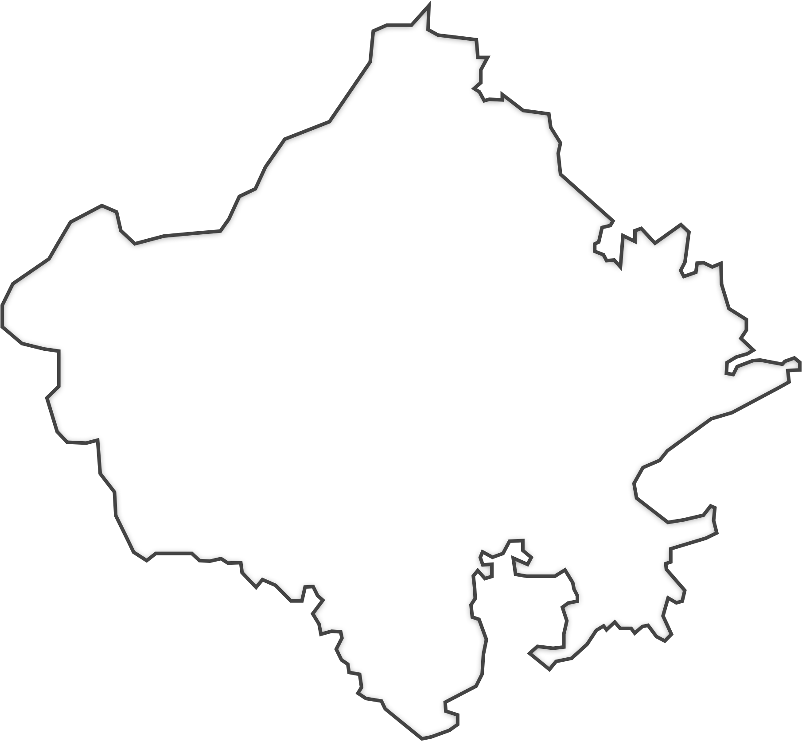

## **1. Headings**
 allows you to create headings by using hash (`#`) symbols.


# Heading 1
## Heading 2
### Heading 3
#### Heading 4
##### Heading 5
###### Heading 6


---

## **2. Paragraphs and Line Breaks**
To create a new paragraph, leave a blank line between two blocks of text.


This is a paragraph.

This is another paragraph.


To create a line break, use two spaces followed by a return.


This is a line with a  
line break.


---

## **3. Emphasis**
You can emphasize text using either **asterisks** or **underscores**.


*Italic Text* or _Italic Text_

**Bold Text** or __Bold Text__

***Bold and Italic Text*** or ___Bold and Italic Text___


---

## **4. Lists**

### **Unordered Lists:**
Use asterisks (`*`), plus (`+`), or minus (`-`) for unordered list items.


* Item 1
* Item 2
  * Subitem 1
  * Subitem 2


### **Ordered Lists:**
Use numbers followed by a period (`1.`).


1. First item
2. Second item
   1. Subitem 1
   2. Subitem 2


---

## **5. Links**
To create hyperlinks, use square brackets for the link text, followed by parentheses for the URL.


[Google](https://www.google.com)


For **inline links** with a title:


[Google](https://www.google.com "Search Engine")


---

## **6. Images**
Images are similar to links but preceded by an exclamation mark (`!`).


For **inline images** with a title:


---

## **7. Blockquotes**
Blockquotes are used for quoting text, and you can create them by using the greater-than symbol (`>`).


> This is a blockquote.
> 
> It can span multiple lines.


---

## **8. Code**
You can format inline code using backticks (\`).


This is `inline code`.


For **multiline code blocks**, use triple backticks (\`\`\`).


```

This is a multiline code block.
It supports indentation and line breaks.

```

You can also specify a language for syntax highlighting:


```python
def hello_world():
    print("Hello, World!")

```

---

## **9. Horizontal Rule**
To create a horizontal rule, use three asterisks, dashes, or underscores.


***
---
___


---

## **10. Tables**
 allows the creation of tables using pipes (`|`) and dashes (`-`).


| Header 1 | Header 2 | Header 3 |
|----------|----------|----------|
| Row 1, Col 1 | Row 1, Col 2 | Row 1, Col 3 |
| Row 2, Col 1 | Row 2, Col 2 | Row 2, Col 3 |


---

## **11. Strikethrough**
To create a strikethrough effect, use two tildes (`~~`).


~~This text is crossed out~~


---

## **12. Footnotes**
Some  parsers support footnotes. Here's how they look:


This is a sentence with a footnote[^1].

[^1]: This is the footnote.


---

## **13. Task Lists**
To create a task list (checklist), use square brackets with spaces or an "x" inside.


- [ ] Task 1
- [x] Task 2 (completed)
- [ ] Task 3


Term 1
: Definition 1

Term 2
: Definition 2

<div>
  <h1>This is a header in HTML</h1>
  <p>This is a paragraph in HTML.</p>
</div>


This is the way to <mark style="background-color: black; color: white;">highlight</mark> any text

This is the way to <mark >highlight</mark> any text

This is the way to <mark style="background-color: gold; color: black;">highlight</mark> any text


this is the way to <u>underline</u>


this is the way to add images




## 14. D2 Diagram 
```d2
x -> y
```


Here are some **advanced** Markdown features that may be supported by certain parsers. These can be useful for more sophisticated formatting and functionality in Markdown:

---

## **15. Definition Lists** (Advanced)
In addition to basic lists, some parsers support **definition lists** (not standard Markdown). This allows you to list terms and their definitions.

Term 1
: Definition for Term 1

Term 2
: Definition for Term 2

---

## **16. Abbreviations**
Some Markdown parsers allow the use of **abbreviations** (like acronyms), which can be expanded when hovered over.
*[HTML]: HyperText Markup Language

When you write `[HTML]` in the document, it will appear as **HTML**, and the full form "HyperText Markup Language" will show when hovered.

---

## **17. Custom Footnotes**
An advanced form of footnotes where the **footnote content** can be placed anywhere, and they are linked dynamically.

Here is a reference to a footnote.[^1]

[^1]: This is an advanced footnote reference, which can be displayed inline or in a separate section.

---

## **18. LaTeX Math Expressions**
Some Markdown parsers support **LaTeX** for mathematical symbols and equations.

```latex
Inline math: $E = mc^2$

Block math:

$$
\int_0^\infty x^2 \, dx
$$
```

- **Inline math** is written within single dollar signs `$`.
- **Block math** is written with double dollar signs `$$`.

---

## **19. Mermaid Diagrams**
Some advanced Markdown parsers, such as GitLab and others, support **Mermaid diagrams** for creating flowcharts, graphs, and more using simple syntax.


Mermaid allows for flowcharts, sequence diagrams, and even Gantt charts to be represented with Markdown.

---

## **20. MathJax**
If your Markdown parser supports **MathJax**, you can include advanced mathematical formulas in a format similar to LaTeX but with more flexibility. 

$$
f(x) = \int_{-\infty}^\infty e^{-x^2} \, dx
$$

---

## **21. Custom Container Blocks**
Some Markdown parsers support custom **container blocks** that allow you to style certain content differently.

Example of a **note** container:

::: note
This is a note container. You can add custom styles here.
:::

Custom containers can also be used for **warning**, **info**, or other types of messages.

---

## **22. HTML Attributes**
Advanced Markdown parsers may allow you to add **HTML attributes** to elements, such as adding classes, IDs, or styles to elements like images, tables, etc.

Example for adding attributes to an image:

```markdown
{:class="my-class" #image-id}
```

---

## **23. Table Captions**
Some Markdown parsers, such as **GitHub-flavored Markdown**, allow you to add captions to tables using HTML:

<table>
  <caption>Table showing sales data</caption>
  <tr>
    <th>Month</th>
    <th>Sales</th>
  </tr>
  <tr>
    <td>January</td>
    <td>$1000</td>
  </tr>
  <tr>
    <td>February</td>
    <td>$1500</td>
  </tr>
</table>

---

## **24. Custom Code Blocks with Syntax Highlighting**
Some parsers allow you to specify the language for syntax highlighting in code blocks using the language name directly after the opening backticks:

```javascript
function greet() {
  console.log("Hello, world!");
}
```
For languages like `python`, `bash`, or `html`, you can specify the language directly to activate syntax highlighting.

---

## **25. Advanced Links (Anchors)**
Some Markdown environments support anchor links (internal navigation within a document) to jump to specific sections.

[Go to Section 1](#section-1)

## Section 1
Some content here.

If you have a header like `## Section 1`, you can link to it with `#section-1`.

---

## **26. Key/Value Pair Tables (YAML-style)**
In some advanced Markdown parsers (such as Jekyll for static sites), **YAML front matter** is used for metadata.

```yaml
---
title: "My Article"
author: "John Doe"
date: "2024-12-29"
---
```

This allows you to add metadata to Markdown files, which can be processed further by static site generators or content management systems.

---

## **27. Multi-column Layouts**
Some Markdown parsers allow for multi-column layouts using HTML or custom syntax.

<div style="column-count: 2;">
This is the first column.

This is the second column.
</div>

This feature is not widely supported in vanilla Markdown but may work with certain parsers or through extensions.

---

## **28. Spoilers**
Some platforms support **spoiler tags** that hide content until a user clicks on it.

<details>
  <summary>Click to reveal spoilers</summary>
  The secret is out!
</details>

---

## **29. Syntax Highlighting with External Tools**
You can use advanced features like **highlighting** certain keywords in code or text when integrated with tools like **Pygments**, **Prism**, or other syntax highlighters.

```python
print("Hello, world!")
```

---

## **30. Advanced Math Symbols and Equations**
You can use specialized symbols in advanced Markdown environments. These include logic symbols, integrals, sums, and matrices using LaTeX.

$$
\sum_{i=1}^n x_i = x_1 + x_2 + \cdots + x_n
$$

---

## **31. Tables with Rowspan and Colspan**
Some Markdown parsers support more advanced table elements like `rowspan` and `colspan` for combining cells.

| Header 1 | Header 2       | Header 3 |
|----------|----------------|----------|
| Row 1, Column 1 | Row 1, Column 2 | Row 1, Column 3 |
| Row 2, Column 1 | Row 2, Column 2 | Row 2, Column 3 |

With HTML support:

<table>
  <tr>
    <td rowspan="2">Rowspan Example</td>
    <td>Column 2</td>
    <td>Column 3</td>
  </tr>
  <tr>
    <td>Column 2 (Row 2)</td>
    <td>Column 3 (Row 2)</td>
  </tr>
</table>

---
