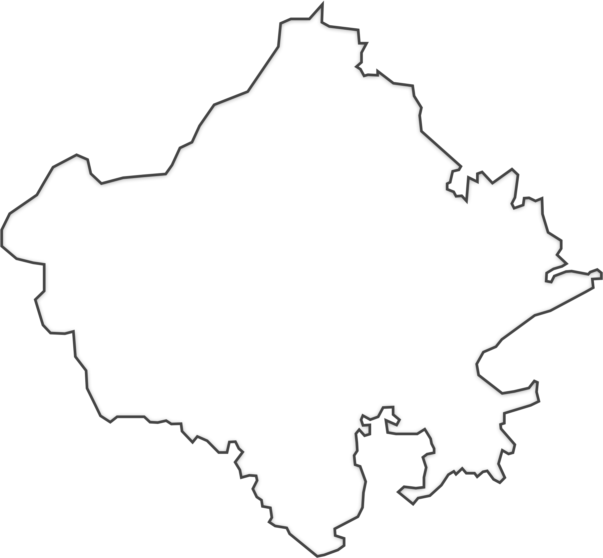

Here is a comprehensive list of the most common ** syntax** elements to help you test the features supported in your  environment:

---

## **1. Headings**
 allows you to create headings by using hash (`#`) symbols.


# Heading 1
## Heading 2
### Heading 3
#### Heading 4
##### Heading 5
###### Heading 6


---

## **2. Paragraphs and Line Breaks**
To create a new paragraph, leave a blank line between two blocks of text.


This is a paragraph.

This is another paragraph.


To create a line break, use two spaces followed by a return.


This is a line with a  
line break.


---

## **3. Emphasis**
You can emphasize text using either **asterisks** or **underscores**.


*Italic Text* or _Italic Text_

**Bold Text** or __Bold Text__

***Bold and Italic Text*** or ___Bold and Italic Text___


---

## **4. Lists**

### **Unordered Lists:**
Use asterisks (`*`), plus (`+`), or minus (`-`) for unordered list items.


* Item 1
* Item 2
  * Subitem 1
  * Subitem 2


### **Ordered Lists:**
Use numbers followed by a period (`1.`).


1. First item
2. Second item
   1. Subitem 1
   2. Subitem 2


---

## **5. Links**
To create hyperlinks, use square brackets for the link text, followed by parentheses for the URL.


[Google](https://www.google.com)


For **inline links** with a title:


[Google](https://www.google.com "Search Engine")


---

## **6. Images**
Images are similar to links but preceded by an exclamation mark (`!`).


For **inline images** with a title:


---

## **7. Blockquotes**
Blockquotes are used for quoting text, and you can create them by using the greater-than symbol (`>`).


> This is a blockquote.
> 
> It can span multiple lines.


---

## **8. Code**
You can format inline code using backticks (\`).


This is `inline code`.


For **multiline code blocks**, use triple backticks (\`\`\`).


```

This is a multiline code block.
It supports indentation and line breaks.

```

You can also specify a language for syntax highlighting:


```python
def hello_world():
    print("Hello, World!")

```

---

## **9. Horizontal Rule**
To create a horizontal rule, use three asterisks, dashes, or underscores.


***
---
___


---

## **10. Tables**
 allows the creation of tables using pipes (`|`) and dashes (`-`).


| Header 1 | Header 2 | Header 3 |
|----------|----------|----------|
| Row 1, Col 1 | Row 1, Col 2 | Row 1, Col 3 |
| Row 2, Col 1 | Row 2, Col 2 | Row 2, Col 3 |


---

## **11. Strikethrough**
To create a strikethrough effect, use two tildes (`~~`).


~~This text is crossed out~~


---

## **12. Footnotes**
Some  parsers support footnotes. Here's how they look:


This is a sentence with a footnote[^1].

[^1]: This is the footnote.


---

## **13. Task Lists**
To create a task list (checklist), use square brackets with spaces or an "x" inside.


- [ ] Task 1
- [x] Task 2 (completed)
- [ ] Task 3


Term 1
: Definition 1

Term 2
: Definition 2

<div>
  <h1>This is a header in HTML</h1>
  <p>This is a paragraph in HTML.</p>
</div>


This is the way to <mark style="background-color: black; color: white;">highlight</mark> any text

This is the way to <mark >highlight</mark> any text

This is the way to <mark style="background-color: gold; color: black;">highlight</mark> any text


this is the way to <u>underline</u>


this is the way to add images




## 14. D2 Diagram 
```d2
x -> y
```