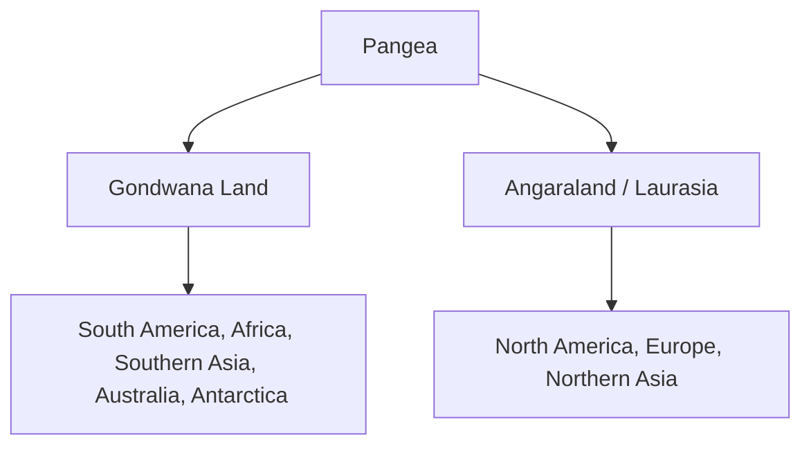
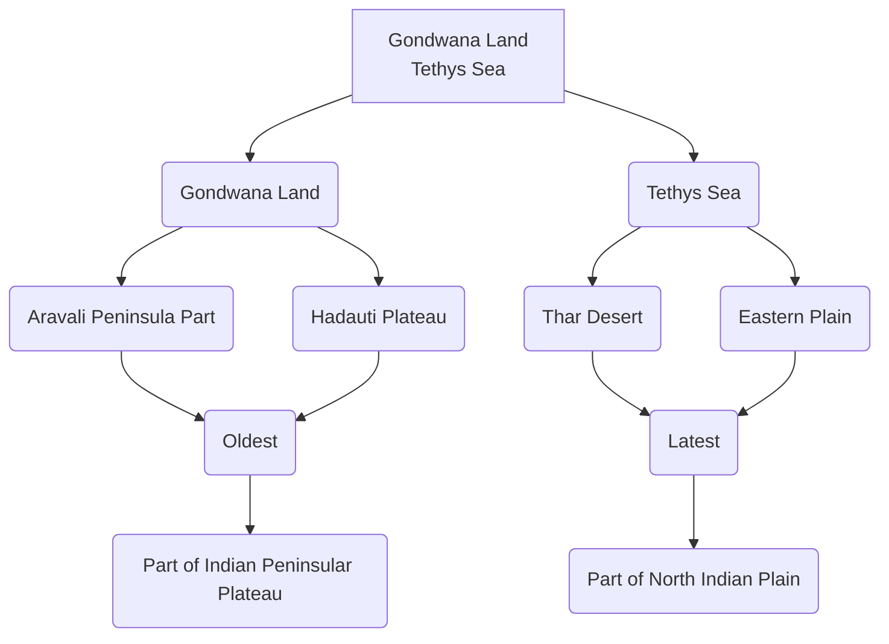

# Origin of Rajasthan

## Carboniferous Era

### Pangea (Supercontinent)
- **Pangea**: According to Alfred Wegener, all continents were united into a single supercontinent called Pangea.
- **Current Division**: Pangea is now divided into two parts:
  1. **Angaraland / Laurasia**:
     - Northern part of Pangea.
     - Continents: North America, Europe, Northern Asia.
  2. **Gondwana Land**:
     - Southern part of Pangea.
     - Continents: South America, Africa, Southern Asia, Australia, Antarctica.

### Panthalassa (Superocean)
- **Panthalassa**: According to Alfred Wegener, all oceans were united into a single superocean called Panthalassa.
- **Main Part**: The Pacific Ocean (46%) is the primary remnant of Panthalassa.

### Tethys Sea
- **Tethys Sea**: A geosyncline located between Angaraland and Gondwana Land.
- **Formation**: The Himalayan mountain range, the Northern Great Plains, and the Thar Desert were formed from the Tethys Sea.

#  Formation of Rajasthan

- **Gondwana**: The Aravalli Peninsula and Hadauti Plateau are part of the Gondwana land.
- **Tethys Sea**: Thar Desert and Eastern Plains of Rajasthan  were formed from the Tethys Sea.