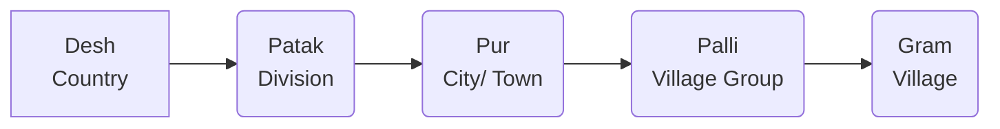
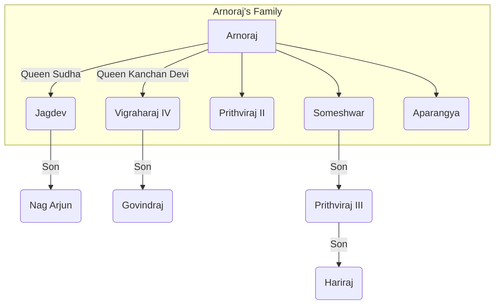

### The History of the Chauhans

## Origin

1.  **Agnivanshi Theory (Fire-Pit Theory)**
    *   According to Chand Bardai's book, *"Prithviraj Raso"* four Rajput clans were created from a fire-pit on Mount Abu by Sage Vashishtha.
        (i) Chauhan
        (ii) Chalukya (Solanki)
        (iii) Parmar
        (iv) Pratihar
    *   Later, Muhnot Nainsi and Suryamal Misran also supported this theory.

2.  **Suryavanshi:**
    *   *Prithviraj Vijay*
    *   *Hameer Mahakavya*
    *   *Hameer Raso*
    *   Ajmer Inscription of Vigraharaja IV
    *   Gaurishankar Hirachand Ojha
    *   *Surjan Charitra*
    *   *Chauhan Prashasti*

3.  **Chandravanshi:**
    *   Hansi Inscription (Haryana) - 1167 CE
    *   Achaleshwar Temple Inscription

4. **Brahmin:**
   * Bijoliya Inscription (Bhilwara) *(Vats Gotriya Brahmin)*
   * Chandravati Inscription (Sirohi)
   * Kayam Raso
    * Dashrath Sharma *(The Early Chauhan Dynasty)*
    * Gopinath Sharma (Based on Bijoliya Inscription)

5.  **Foreign:**
    *   James Tod (Saka/Scythian)
    *   William Crook (wrote the biography of James Tod)
    *   Smith

6. **Lineage of Indra**

*  Descendants of Indra mentioned in the *Sewari Inscription of Rao Pal* (Pali).

### 2. Bijolia Inscription (1170 AD), Bhilwara

This inscription was installed by a Digambara Jain named Loladu at the Parshvanath Temple. Key information from this inscription includes:

*   **Chauhan Dynasty Origin:**  The Chauhan dynasty is described as being of *Gautriya Brahmin* origin.
*   **Construction of Sambhar Lake:** Vasudev is credited with the construction of Sambhar Lake.
*   **Victory over Delhi:**  Vigraharaj II is mentioned as having conquered Delhi.
*   **Time of Installation:**  The inscription was installed during the reign of Someshwar.
*   **Donation of Rewana Village:**  Someshwar donated the village of "Rewana" to the temple.
*   **Title of Someshwar:** Someshwar is given the title "Pratap Lankeshwar" in this inscription.
*   **Religious Information:**  The inscription provides information about Shaivite and Jain pilgrimage sites.
*  **Ancient Names:**  Provides ancient names of cities and towns in Rajasthan
*   **Administrative Division:**  The inscription details the administrative division of the kingdom:

*   **Administrative Officials:** Information regarding administrative officials is present.
    *   **Pratihara Officer:** *Paristhiti*
    *   **Larger Unit Officer:** *Mahattar*
    *   **Village:**  *Gram*

*   **Ancient Names of Rajasthan Cities:**

| Current Name| Ancient Name |
| -----------| -----------|
| Bijolia | Vijayavalli|
| Harsol| Uttampuri|
| Nagda | Naghrada|
| Mount Abu | Mandukpur|
| Sambhar| Shakambhari|
| Nagaur| Ahichhatrapur|
| Nadol | Naddul |
| Bhinmal| Shrimal |
| Delhi | Dhillika |
| Jalore| Jabalipur|
   

*   **Administrative Division Summary (as per inscription):**
    Desh (Country) - Patak (Region) - Pur (City/Town) - Palli (Hamlet) - Gurugram (Village)
*   **Authors and Engravers:**
    *   **Composer:** Gunabhadra
    *   **Writer:** Keshav
    *   **Engraver:** Govind

### 3. Origin Place of the Chauhans

*   **Sapadlaksha:** The area around Sambhar Lake is considered the origin place of the Chauhans.
*  **Historian Ramkrishna Asopa's View:**  Initially, Chauhans resided around Sambhar Lake, according to historian Ramkrishna Asopa.
*   **Capital:** Ahichhatrapur (Nagaur). *Ahi* also means snake.
*   **Chauhan States/Principalities:**
    *  Sambhar / Ajmer
    *   Ranthambore
    *   Nadol
    *   Jalore
    *   Sirohi
    *   Bundi
    *   Kota

Okay, here's a structured and translated version of the notes on the history of the Chauhans of Sambhar/Ajmer, formatted in Markdown:

# History of the Chauhans of Sambhar/Ajmer

This section details the lineage and significant events of the Chauhan rulers of Sambhar/Ajmer.

## 1. Vasudev

*   **Establishment of the Chauhan Kingdom:** According to Rajshekhar's book 'Prabandh Kosh,' Vasudev established the Chauhan kingdom in Sambhar in 551 AD.
*   **Bijolia Inscription (1170 AD):**  States that he built Sambhar Lake and made Nagaur his capital.

## 2. Guvak I

*   **Feudal Status:** Initially, the Chauhans were vassals of the Gurjar Pratiharas.
*   **Title of 'Veer':**  Pratihara king Nagabhatta II (Jeenagal) gave him the title of 'Veer' (Brave).
*   **Independence:**  Later, Guvak refused to accept the Pratiharas' authority.
*   **First Independent Chauhan Ruler:**  He is considered the first independent Chauhan king.
*  **Harshnath Temple:** Guvak I built the Harshnath Temple, which is the *Kuldev* (family deity) of the Chauhans.

## 3. Chandraraj

*   **Queen Atmaprabha/Rudrani:** His queen, Atmaprabha/Rudrani, worshipped Lord Shiva at Pushkar Lake by lighting 1000 lamps.
*   **Expert in Yogic Practices:** She was skilled in yogic practices.

## 4. Vakpatiraj

*   **Victor of 108 Wars:** He is known as the victor of 108 wars.
*   **Establishment of Nadol:** His son, Lakshmanraj, established the Chauhan kingdom in Nadol (Pali).

## 5. Vigraharaj II

*   **Defeat of Mularaj I:** He defeated the Chalukya king of Gujarat, Mularaj I.
*   **Temple of Ashapura Mata:** He built the temple of their family deity, Ashapura Mata, in Bharuch (Gujarat).

## 6. Govind III

*   **Resistance against Ghazni:** According to historian Farishta, he prevented the king of Ghazni from invading Marwar.
*   **Alliance with Bhim I:** The Chalukya king of Gujarat, Bhim I, was also with him during this time.
*   **Title:** *Vairighata* (according to Prithviraj Vijay) which means 'Destroyer of Enemies'.

## 7. Durlabhraj III

*  **Confrontation with Ibrahim:** According to Dashrath Sharma, he faced the king of Ghazni, Ibrahim.

## 8. Vigraharaj III
*  **Defeat of Shahabuddin:** He defeated the king of Ghazni, Shahabuddin.

## 9. Prithviraj I

*   **Defeated Bagulisha:** Defeated the Muslim invader, Bagulisha.

## 10. Ajayraj (1105-1133 AD)

*   **Establishment of Ajmer:** Founded Ajmer in 1113 AD and built a fort there.
*   **Defeat of Gardat Matang:** Defeated Gardat Matang (king of Ghazni).
*   **Golden Kalash Gift:** Donated a golden kalash to the Parshvanath temple.
*   **Presided Over Debate:** He presided over a debate between the Digambara and Svetambara sects.
*   **Coinage:** Issued silver and copper coins in the name of his queen, Somaldevi/Sobhalekha, known as 'Ajayapriya Dramma'.
*   **Renunciation:** In his final days, he handed over power to his son, Arnoraj, and became a renunciate.

## 11. Arnoraj (1133-1155 AD)

*   **Defeat of Turks:** Defeated the Turks in 1135 AD and built the Anasagar Lake at the battle site.
*   **Varaha Temple:** Constructed the Varaha Temple (Lord Vishnu) in Pushkar.
*   **Defeated Naravarman:** He defeated the Malwa ruler Naravarman.
*   **Defeat of Jaysingh Siddharaj:** He defeated the Chalukya king of Gujarat, Jaysingh Siddharaj.
*   **Marriage Alliance:** Jaysingh Siddharaj married his daughter Kanchan Devi to Arnoraj.
*   **Defeat at Hands of Kumarapal:** He was defeated by the Chalukya king of Gujarat, Kumarapal, and married his daughter 'Jalhann Devi' to Kumarapal. After winning Ajmer, Kumarapal went to Chittorgarh.
*   **Mention in Literature:** This war is described in ‘Prabandh Chintamani’ and 'Prabandh Kosh.'
*   **Land Grant to Jain Sect:**  He gave land grants to the Kharataragachchha (Jain) sect.
*   **Court Scholars:** Devbodh, Dharmaghosh
*   **Murder:** He was killed by his son, Jagdev.

## 12. Jagdev

*   **Removal from Power:** He was removed from power by his brother, Vigraharaj IV.

## 13. Vigraharaj IV (1158-63 AD)

*   **Golden Age:** According to Dashrath Sharma, his reign was the golden age of the Chauhans of Ajmer.
*   **Defeat of Khusroshah:** According to 'Lalit Vigraharaj,' he defeated Khusroshah of Ghazni.
*   **Defeated Kumarapal:** He defeated Kumarapal Chalukya of Gujarat.
*   **Defeat of Tomar Rulers:** According to the Bijolia Inscription, he defeated the Tomar rulers of Dhillika (Delhi) and made them his vassals.
*  **Delhi Shivalik Pillar Inscription:** Installed the Delhi Shivalik Pillar Inscription. This inscription is written just below the Ashoka's Delhi Topra inscription (Haryana).
*   **Bisalpur Tank:** He constructed the Bisalpur Tank and built a pond and a Shiva temple there.
*   **Harkeli Drama:** He wrote the play 'Harkeli' (based on Bharavi's 'Kiratarjuniya').
*   **Ban on Animal Slaughter:**  He banned animal slaughter on Ekadashi day at the request of Dharmaghosh Suri.
*   **Saraswati Kanthabharan Pathshala:** Established the Sanskrit school 'Saraswati Kanthabharan' in Ajmer.  Lines from 'Harkeli' and 'Lalit Vigraharaj' were written on the walls of the school.
*   **Conversion to Mosque:**  Qutb-ud-din Aibak demolished this school and converted it into a mosque called 'Dhai Din ka Jhopra'.
*  **Urs of Peer Panja Shah:** An Urs (festival) of Peer Panja Shah is held for two and a half days near this mosque.
*   **Court Scholar:**
    *   Somdev: Author of 'Lalit Vigraharaj,' which narrates the love story of Vigraharaj and Desal Devi.
*   **Titles:**
    *   Bisaldev
    *   Kavi Bandhu (according to Prithviraj Vijay) or Kavi Valav (Udayabhatt)
*   **Comparison by Kilhorn:**  Kilhorn compared Vigraharaj to Kalidas and Bhavabhuti.

## 14. Aprangya

*   **Removal by Prithviraj II:** Removed by Prithviraj II.

## 15. Prithviraj II

*   **Palace in Hansi:** Built a palace in Hansi (Haryana) and appointed his maternal uncle, Chulhil Kalch, there.
    *   **Hansi Inscription (1167 AD):**
*   **Ghosunda Inscription:** According to the Ghosunda (Bhilwara) Inscription (1168 AD) of the Ruthi Rani Temple (Shiva Temple), he acquired it from his king, Bahul.
     * The inscription mentions the queen's name as Suhav Devi
*  **Suhveshwar Temple:** Built the Suhveshwar Temple (Shiva Temple) in Menal.

## 16. Someshwar

*   **Time in Gujarat:**  He spent much of his time in Gujarat.
*  **Defeat of Mallikarjuna:** Defeated Mallikarjuna, the king of Bahu Kantak, who was under Kumarapal.
*   **Queen:** Karpuri Devi (daughter of Chede King Achalraj Kalpuri).
*   **Vaidyanath Temple:** Built the Vaidyanath Temple in Sambhar and placed statues of Brahma, Vishnu, and Mahesh in it.
*   **Statues in Ajmer:**  Installed his own statue and that of his father, Arnoraj, in Ajmer.
*   **Title:** *Pratap Lankeshwar*.
*   **Bijolia Inscription:**  The Bijolia inscription was installed during his reign.

## 17. Prithviraj III (1177-92 AD)

*   **Father:** Someshwar
*   **Mother:** Karpuri Devi (Samritika)
*   **Ascension to Throne:** Became king at the age of 11.
*   **Chief Ministers:**
    *   Kadambvas/Kaimas
    *   Bhuvanmalla
    *   Skand
    *   Vaman
    *   Sodh

*   **Suppression of Rebellions:**  Suppressed the rebellions of his cousins, Nag Arjun and Aparangya.
    *  Nag Arjun had made Gurugram his main center
*  **Bhandanak Tribe:** In 1182 AD, he revolted against the Bhandanak tribe in the Mathura, Alwar, and Bharatpur regions. This information is obtained from the books of Jinpati Suri. The Bhandanak tribe had come from the Satluj region of Punjab and started living in the Gurugram Hisar regions.

*   **Battle of Mahoba/Tumul (1182 AD):**
    *   **Participants:** Prithviraj III vs. Parmadidev Chandela (Mahoba, M.P)
    *   **Cause:** Parmadidev Chandela had the wounded soldiers of Prithviraj III killed.
    *   **Outcome:** Prithviraj III won and made Panjaray the ruler of Mahoba.
    *  **Parmardidev's Commander:** Alha and Udal
*   **Battle of Nagaur (1184 AD):**
    *   **Participants:** Prithviraj III vs. Bhim II Chalukya (Gujarat).
    *   **Cause:** Both wanted to expand their empires. There was a long-standing enmity between the Chalukyas and the Chauhans.
    *   **Marriage Dispute:** Both wanted to marry the Paramara princess of Abu, Ikshni Devi, but Prithviraj married her.
   * **Peace Treaty:** Jagdev Pratihar mediated a treaty between them (Bhim-II's commander)

*   **Chauhan-Gahadwala Conflict:**
     * **Participants:** Prithviraj III vs. Jayachand (Kannauj).
    *   **Causes:**
        1. Succession to Delhi
        2.  Jayachand was helping Parmadidev against Prithviraj.
        3. Prithviraj kidnapped and married Jayachand's daughter, Sanyogita.
    * **Historical Acceptance** Dashrath Sharma accepted this love story as a historical fact (The early Chauhan Dynasty)

*   **First Battle of Tarain (1191 AD) (Haryana):**
    *   **Participants:** Prithviraj III vs. Ghori (Ghazni).
    *   **Causes:**
        1. Ghori had captured Tabarhinda (Bhatinda).
        2.  Long-standing enmity between the Chauhans and the kings of Ghazni.
    *   **Outcome:** Prithviraj III won and captured Jiauddin.
    *   **Govindraj Tomar's Role:**  Govindraj Tomar of Delhi had injured Ghori.

*   **Second Battle of Tarain (1192 AD):**
    *   **Participants:** Prithviraj III vs. Ghori
    *   **Outcome:** Ghori won.
   *  **Capture and Death:** Prithviraj was arrested near Sirsa at a place called Saraswati and was killed.
     * **Rule under Ghori** According to Hasan Nizami, Prithviraj ruled under Ghori for some time.
     * **Hasan Nizami's Book:** 'Taj-ul-Masir'
    *   **Reasons for Prithviraj's Defeat:**
        *   Disputes with neighboring kingdoms prevented them from assisting him against Ghori.
        *  Prithviraj gave Ghori enough time to prepare for the war after the first battle of Tarain.
        *  Prithviraj's army was smaller than Ghori's in the second battle of Tarain, and most of his commanders were busy in other border areas.
        *   Ghori was a skilled commander and defeated Prithviraj with his diplomacy.
        *   The Turkish army used horses, while the Rajputs used elephants.
        *   The Turks used lighter weapons than the Rajputs.

*   **Significance of the Battle of Tarain:**
    *   **Easy Rule for Ghori:** Prithviraj's defeat made it easier for Ghori's successors to rule in India.
    *   **Foundation of Turkish Rule:**  The foundation of Turkish rule was laid in India.
    *   **End of Rajput Ambitions:** The defeat of the Rajputs ended their political ambitions, and no Rajput king could gain control over Delhi after Prithviraj.
    *   **Foreign Rule:** After the second battle of Tarain, the period of foreign rule started in India, which continued till 1947 AD.
    * **Impact of Turkish Rule:**
      *  A. Positive Effects -
           * Rise of Sufi-Islamic governance in India that was reflected in Architecture, literature, music, painting etc
           * Sufi and Bhakti movement started in India.
      *  B. Negative Effects -
           *   Many invaders destroyed Hindu temples and Buddhist monasteries, leading to the decline of art and culture.
           * Buddhist culture almost disappeared from India after 1200 AD.
           *  The Turks destroyed educational centers, leading to the decline of the education system.

## 18. Cultural Achievements of Prithviraj

*   **Department of Art and Culture:** Established a department of art and culture.
     * Minister - Padmanabh
*   **Pithoragarh Fort:** Built the Pithoragarh fort (Delhi).
*   **Court Scholars:**
    1. Chandrabardai (Prithvibhatt) - *Prithviraj Raso*
    2. Jayanak - *Prithviraj Vijaya*
    3. Vagishwar Janardan
    4. Vidyapati Gaud
    5. Vishwaroop
    6. Ashadhar
*   **Titles:**
    *   Rai Pithora
    *   Dalpangul
*   **Assessment of Prithviraj Chauhan:**
    *   Accused of being an immature military leader and an unvisionary king, but this is not correct.
    *   He did not face defeat in any war before the Second Battle of Tarain, hence he cannot be called an immature military leader.
    *   The Indian culture of that time included not attacking the enemy's fleeing army and releasing the enemy after they had asked for forgiveness, and Prithviraj Chauhan was also following these ideals.
    *   Although the Turkish defeat paved the way for India's slavery, his importance in medieval Indian history cannot be ignored.

## 19. Govindraj

*   **Acceptance of Turkish Rule:** He accepted Turkish rule.  His uncle, Hariraj, removed him from power.
*  **Establishment of Ranthambore:** He went to Ranthambore and established the Chauhan kingdom there.

## 20. Hariraj

*   **Attack on Delhi:** He sent his commander 'Chandvraj' to attack Delhi, but he was defeated.
*   **Qutb-ud-din Aibak's Attack:** Qutb-ud-din Aibak attacked and defeated Hariraj, capturing Ajmer.
*   **Suicide:**  Hariraj committed suicide, and the Turks took control of Ajmer (1194 AD).

Okay, here's a structured and translated version of the notes on the history of Ranthambore, formatted in Markdown:

# History of Ranthambore

This section details the history of the Chauhan dynasty that ruled in Ranthambore.

## Rulers of Ranthambore

1.  **Govindraj:**
    *   Son of Prithviraj Chauhan III.
    *   Established the Chauhan kingdom in Ranthambore in 1194 AD.
2.  **Valhana**
3.  **Prahladan**
4.  **Veernarayan:**  Killed while fighting against the Sultan of Delhi, Iltutmish.
5.  **Vagbhatta:**  Nasiruddin Mahmud of Delhi attacked Ranthambore, but he failed to capture it.
    *   **Note:** Defeated Qutbuddin Hasan, the commander of Razia Sultan.
6.  **Jaitrasimha:**
    *   Ruled for 30 years.
    *   Made his son, Hammir, the king during his lifetime.
7.  **Hammir (1282 AD - 1301 AD):**
    *   Victorious in 16 out of 17 battles.
    *   Defeated several neighboring kings.

## Hammir's Conquests:

*   Pratap Singh (Abu)
*   Samar Singh (Mewar)
*   Bhoj Parmar (Dhar/Dhara Nagari) - Malwa
*   Arjun (Bhinmal) M.P

## Conflicts with the Delhi Sultanate

*   **Jalaluddin Khilji's Attacks:** Jalaluddin Khilji of Delhi attacked Ranthambore twice (1290 AD and 1292 AD), but was unsuccessful.
*   **Jalaluddin's Remark:** After his failure, Jalaluddin Khilji said, "I do not consider such ten forts equal to a Muslim's hair."
*   **Description in Literature:** Amir Khusrau described Jalaluddin Khilji's attacks in his book, *"Miftah-ul-Futuh."*

### Alauddin Khilji's Attack (1301 AD)

*   **Causes of the Attack:**
    *   Alauddin wanted to expand his empire.
    *   Ranthambore Fort was famous for its strategic importance (located on a high hill).
    *   Ranthambore Fort was situated on the trade route from Delhi to Malwa and Gujarat.
    *   Hammir had given shelter to the rebels of Alauddin Khilji:
        1.  Muhammad Shah
        2.  Kehdrah

## Armies

| Alauddin Khilji                | Hammir            |
|---------------------------------|--------------------|
| 1. Nusrat Khan                  | 1. Bhim Singh    |
| 2. Ulug Khan                     | 2. Dharm Singh   |
| 3. Alp Khan                      |      |

*   Nusrat Khan and Bhim Singh were killed in battle.
*   **Saka of 1301 AD:** The saka took place in Ranthambore in 1301 AD. This was the first Saka of Rajasthan.
*   **Jauhar by Rangadevi:**  Hammir's queen, Rangadevi, committed jauhar.
*   **Description of Jauhar:**  Amir Khusrau described this Jauhar in his book, *“Khazain-ul-Futuh”*.
 *  This is the first information about Jauhar in the Persian Language.
*  **Kesaraiya:**  Hammir committed Kesaraiya.
*   **Capture of Ranthambore:**  Alauddin Khilji captured Ranthambore and handed it over to Ulug Khan (July 11, 1301).
*   **Amir Khusrau's Statement:** Amir Khusrau stated, "Today, the house of *Kufr* (infidelity) has become the house of Islam."
*   **Deval De:**  Hammir's daughter, Deval De, committed suicide by jumping into Padam Talab (water jauhar).
*   **Betrayal:** Rahmal and Ratipal betrayed Hammir.

## Hammir's Cultural Achievements:

*   **Shringar Har:** Hammir wrote a book named *Shringar Har.*
*   **Koti Yagya:** He organized a 'Koti Yagya.'
    *   **Priest:** Vishwaroop
*   **32-Pillared Chhatri:** He built a '32-Pillared Chhatri' in Ranthambore in memory of his father, Jaitrasimha’s, 32-year reign.
*   **Court Scholars:**
    *   Raghavdev (Hammir's guru)
    *   Bajaditya

## Evaluation of Hammir

*   **Accusations:** Hammir is accused of being stubborn and waging war through deceit, but these accusations can be refuted.
*   **Financial Need for War:** At that time, wars were going on externally and required more money, and this was done by all kings.
*   **Unblemished Record:** Hammir never lost any war before this.
*   **Protection of the Supplicant:** Protecting those who seek refuge was an ideal of Indian culture at that time, and Hammir was following these ideals.
*   **Sacrifice and Bravery:** His bravery and willingness to sacrifice everything for the protection of those who sought refuge is not only unforgettable, but also places him at the forefront.

## Couplet about Hammir

*   A poet has rightly said about Hammir:

    "Sih gaman, sa purus vachan, kadali phal ek baar
    Tiriyan tel, Hammir hath, chade na duji baar !."

    *   **Translation:**  "The lion walks once, a noble person speaks once, a banana tree bears fruit once, oil on a woman's hair is applied once, and Hammir's stubbornness will not rise twice."

## Books Related to Hammir:

1.  **Nayanchandra Suri:** *Hammir Mahakavya*
2.  **Sarngadhar:** *Hammir Raso*
3.  **Jodhraj:** *Hammir Raso*
4.  **Chandrashekhar:** *Hammir Hath*
5.  **Amrit Kailash:** *Hammir Badhan*
6.  **Bhim Vyas:** *Hammirrayan*
7.  **Mehra:** *Hammir Raso*

Okay, here's a structured and translated version of the remaining notes, covering the histories of Nadol, Bundi, Kota, Jhalawar, Sirohi, and Jalore, formatted in Markdown:

# History of Various Regions of Rajasthan

This section details the history of different regions of Rajasthan, including Nadol, Bundi, Kota, Jhalawar, Sirohi, and Jalore, focusing on their ruling dynasties and key historical events.

## 1. Nadol (Pali)

*   **Ruling Dynasty:**  Chauhan dynasty.

1.  **Lakshmanraj:**
    *   Father: Vakpatiraj (Sambhar)
    *   Established the Chauhan kingdom in Nadol in 960 AD.
    *   Built the temple of their *Kuldevi*, Ashapura Mata.
2.  **Kelhan:**
    *   Participated in the Battle of Kanhad.
    *   Married his daughters, Meega Devi and Bhanjar Devi, to Dharavarsha Parmar of Abu.
    *   His younger brother, Kirtipal, established the Chauhan kingdom in Jalore.

## 2. Bundi

*   **Ruling Dynasty:** Hada branch of the Chauhan dynasty.
*   **Original Rulers:** Originally, the Meena kings ruled Bundi.
*   **Origin of Name:** Named Bundi after the Meena king, Bunda Meena.
*   **Ancient Name:** The Shakpur (Pali) inscription mentions Bundi as 'Vrindavati.'

1.  **Deva:**
    *   Defeated Jeta Meena in 1241 AD and established the rule of the Hada branch of the Chauhan dynasty in Bundi.
2.  **Jaitrasimha:**
    *   Conquered and merged Kota into Bundi in 1274 AD.
3.  **Varsingh:**
    *   Built the Taragarh Fort in Bundi in 1254 AD.
    *   The fort is famous for its mural paintings.
4.  **Surjan:**
    *   Made a treaty with Akbar in 1569 AD after Akbar attacked Ranthambore.
    *   Bhagwat Das of Amer played a key role in the treaty.
    *   Built the Ranchod Temple in Prashika.
    *   Court Scholar: Chandrashekhar; Books: *Hameer Hath*, *Surjan Charit.*
5.  **Buddha Singh:** Book: *Nehtarang.*

### Succession Struggle of Bundi

*   A succession struggle occurred between Buddha Singh's two sons, Dalel Singh (adopted son) and Ummed Singh.
*   Sawai Jai Singh supported Dalel Singh.
*   The Marathas sided with Ummed Singh.
*   Bundi was the first princely state in Rajasthan in which the Marathas interfered (in internal politics).
*   **Amar Kanwar:**  Sister of Sawai Jai Singh and queen of Buddha Singh, who invited the Maratha commander 'Malhar Rao Holkar' in favor of Ummed Singh.
*   **Krishna Kanwar:** Daughter of Sawai Jai Singh and queen of Dalel Singh.
6. **Vishnu Singh:** He made a treaty with the British in 1818 AD.

## 3. Kota

*   **Ruling Dynasty:**  Hada branch of the Chauhan dynasty.

1.  **Madho Singh:**
    *   Son of Raja Ratna Singh of Bundi.
    *   In 1631 AD, Mughal emperor Shah Jahan divided the Bundi state and made Madho Singh the independent king of Kota.
    *   After his success in the Central Asian campaign, Shah Jahan gifted him a horse named "Bad Raghatar."
    *   Mughal Emperor Jahangir gave King Ratna Singh of Bundi the titles of Ramraj and Sarbulandray.
2.  **Mukund Singh:**
    *   Built the Abli Meeni Mahal in Kota.
    *   Killed fighting in the Battle of Dharmat.
3.  **Bhim Singh:**
    *   Follower of the *Vallabh Sampraday*.
    *   Changed his name to Krishnadas.
    *   Renamed Kota to 'Nandgram' and Shergarh Baro to 'Barsana.'
    *   Built the Sanwariya Ji temple in Baro.
    *   Invaded Bundi at the behest of Mughal emperor Farrukhsiyar and defeated King Buddha Singh of Bundi.
 * Renamed Bundi as Farrukhabad.
*  He brought cannons named ‘Kahal Bijli’ and ‘Dhuldhaji’ from the Bundi fort.
4.  **Ummed Singh:**
    *   Made a treaty with the British in 1817 AD.
    *   A treaty was made between the British and Kota in February 1818.
    *   **Terms of the Treaty:**
        *   Jalim Singh Jhala and his descendants would always remain the Diwan of Kota.
        *   All powers of Kota would be given to the Diwan.
5. **Kishore Singh II:**
    *   **Battle of Mangrol (1821 AD):**
        *   Kishore Singh II vs. Jalim Singh Jhala (Jalim Singh Won).
        *   The British supported Jalim Singh Jhala in this battle (helped by Colonel James Tod).
6.  **Ram Singh II:**
    *   In 1838 AD, the British divided the Kota state, and Madan Singh Jhala of Jhalawar was declared an independent king.
    *   He was the grandson of Jalim Singh Jhala.
    *   Jhalawar was the last princely state of Rajasthan.
    *   Capital: Jhalrapatan

## 4. Jhalawar

*   **Ruling Dynasty:**  Jhala dynasty.

1.  **Madan Singh:**
    *   Grandson of Jalim Singh Jhala.
    *   Established a separate state from Kota in 1837 AD.
    *   The Jhalawar state was recognized by the British in 1838 AD.
    *   It was the last princely state of Rajasthan.
    *   Capital: Jhalrapatan, on the banks of the Chandrabhaga River.
       * Other names - “City of bells”
       * “City of Bells” is called Ratti of Rome.
2.  **Rajendra Singh:**
    *   Built the Kashtprasad (Wooden Palace) in Jhalawar.
    *   Opened all the temples of Jhalawar for the Harijans.

## 5. Sirohi

*   **Ruling Dynasty:**  Deora branch of the Chauhan dynasty.

1.  **Lumba:**
    *   Defeated the Parmars in 1311 AD and captured Abu and Chandravati (Sirohi).
    *   Made Chandravati the capital.
2.  **Shitalman:**
    *   Made Shivpuri his capital in 1405 AD.
3.  **Sahasmall:**
    *   Founded Sirohi in 1425 AD and made it his capital.
4. **Surtan:**
    *   Bika Deora also wanted to capture Sirohi. Therefore, at the request of Rai Singh of Bikaner, Surtan gave half of Sirohi to Akbar, and Akbar gave it to Jagmal, the younger brother of Pratap.
    *   Earlier, Akbar had given Jagmal the Jahajpur (Bhilwara) pargana.
    *   **Battle of Dattani (1583 AD):**
        *   Surtan vs. Akbar.
        *   **Winners:** Jagmal (Pratap's brother), Rai Singh (son of Kalyansen), and Dauti Singh (Koliwada).
        * Jagmal and Rai Singh were killed in the battle.

 *  Court Scholar - Dursa Adha - ‘Rao Surtan Ra Kavit’.
 *   A statue of Dursa Adha is installed in Achalgarh Fort.
5.  **Vairisal:**
    *   Gave shelter to Ajit Singh of Jodhpur in the village of Kalindri (Sirohi) against Aurangzeb.
6.  **Shiv Singh:**
    *   Made a treaty with the British in 1823 AD.
    *   Sirohi was the last princely state of Rajasthan to make a treaty with the British.

## 6. Jalore

*   **Ancient Name:**  Jalore was called 'Jabalipur' because of Sage Jabali.
     * Jabalipur mentioned in Bijolia Inscription
*   **Origin of Name:**  Named Jalore due to the abundance of *Jal* (Salvadora oleoides) trees.
*   **Fort Location:** Jalore Fort is located on Sonagiri Hill.
*   **Fort Names:** The fort is also called Suvarnagiri, Songarh, and Kanchanagiri.
*   **Chauhan Branch:**  The Chauhans of Jalore are known as 'Songara Chauhans.'

1.  **Kirtipal:** (Younger brother of Kelhan, ruler of Nadol)
    *   Participated in the Battle of Kaydra.
    *   Defeated Samant Singh of Mewar in 1179 AD.
    *   Defeated Kuntpal Parmar in 1181 AD and established the Songara branch of the Chauhan dynasty in Jalore.
    *  The Sundha Inscription calls Kirtipal 'Rajeshwar'.
    *   According to Muhnot Nainsi’s 'Nainsi-ri Khyat':  “Kirti was a great king.”
2.  **Samar Singh:**
    *   Built the ramparts, armory, and treasury in Jalore.
    *   Married his daughter, 'Liladevi,' to the Chalukya king of Gujarat, 'Bhim II'.
3.  **Uday Singh:**
    *   Iltutmish conquered Mandore (Jodhpur) and Nadol (Pali).
    *   Defeated Lavana Prasad of Gujarat.
4.  **Chachigdev:**
    *   Title: 'Maharajadhiraj'.
    *   He was a contemporary of Nasiruddin Mahmud and Balban, but they did not dare to attack Jalore.
5.  **Samant Singh:**
     * Jalaluddin Khilji attacked Jalore in 1291 AD.
     *  Jalaluddin reached Sanchor, but Samant Singh, with the help of Sajid Vaghela, stopped him.
6.  **Kanhad Dev:**
    *   Alauddin Khilji attacked Siwana (Balotra) and Jalore in 1311 AD.
    *   **Causes:**
        1.  Alauddin's policy of empire expansion.
        2.  Jalore was located on the trade routes from Delhi to Gujarat and South India.
        3.  During the Gujarat invasion, Kanahad Dev did not allow Alauddin to pass through Jalore.
        4. Shortage of supplies in Alauddin's army while returning from the Gujarat campaign.
 * Commander Jaita Devda attacked and broke the Shivling of Sirnath Temple.
      5. According to Farishta, in 1305 AD, 'Ain-ul-Mulk' Multani attacked Jalore and took Kanahad Dev to Delhi. (for a treaty)
        * But there he accepted Alauddin's challenge of war.
        6. According to Nainsi, the reason for the attack was Alauddin's daughter Firoza's attraction towards Veeramdev.
          * (She committed Sati) Firoza’s Dhai Maa- Gul Vihisht
     *   **Alauddin's Attack on Siwana (1308 AD):**
		*   Siwana was called the key to Jalore.
		*   At that time, the fort of Siwana was under the control of Kanahad Dev's nephews 'Satal' and 'Som.'
		*   A wounded soldier betrayed them.
		*   The first Saka of Siwana took place in 1308 AD under the leadership of Satal and Som.
		*   Alauddin captured Siwana and named it "Khairabad" and handed it over to Kamaluddin Gurg.
		*  A Turk commander named Nahar Khan was killed in this attack.
		*   **Note:** Saran was called 'Rahamarki Chaki,' and Alauddin renamed it 'Nohar.'
		*   The Turks broke the Mahavir temple in Sanchor and destroyed the educational center 'Bhinmal.'
    *   **Battle of Malkana (Nagaur):**
        *   Rashmi Kanhaddev defeated the Turks and arrested the Turk commander 'Shams Khan.'
   *   **Alauddin's Attack on Jalore (1311 AD):**
	*   Bika Dahiya betrayed Kanhad Dev.
	*   Bika Dahiya was killed by his wife, Heerde.
	*   In 1311 AD, Saka took place in Jalore under the leadership of Kanhad Dev and Veeramdev.
	*   Alauddin built the Ala Mosque (Tophkhana) here.

* **Padmanabh** - (i) *Kanhaddev Prabandh*
                   (ii) *Veeramdev Songara ri Baat*

This expanded and organized version should give you a comprehensive overview of the histories of these regions.
