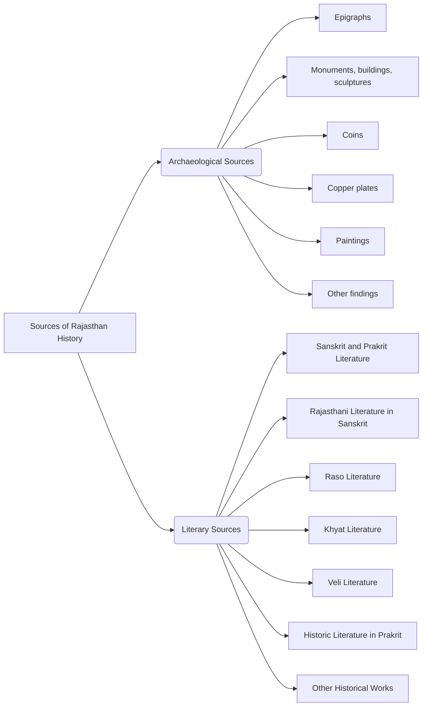

## Father of Rajasthan History

### Colonel James Todd (1892-1971) 
- **Political agent of Mewar** ( 1818- 1821)
- known as **Ghode wale Baba**
- wrote **Annals and Antiquties of Rajasthan** / **Central and western Rajput states of India** 
    + published in 1829 in London
    + GH Ojha translated in  Hindi
- wrote **Travel in western India** 
    + published in 1837 by his wife after death

## Inscriptions of Rajasthan

### Raisingh Inscription
- **Creator**: Made by Jain saint **Jaita**, associated with Bikaner rulers.  
- **Date**: Created in **1594 AD**.  
- **Content**:  
  - Chronicles the **achievements of Bikaner rulers** from **Rao Bika to Rao Rai Singh**. 
  - **Bikaner Fort** constructed by Raisingh under minister **Karmachand** from **1589 to 1594**

### Ghosundi Inscription
-  First epigraphic evidence of **Lord Narayana worship**.  
- **Time Period**:  **1st century B.C.**.  
- **Location**: **Ghosundi village**, Chittorgarh district, Rajasthan.  
- **Language**:   **Sanskrit**.
- **Script**:   **Brahmi**.
- **Content**
    - Records the construction of an **enclosing wall** (**NarayanaVatika**) around a stone object of worship.  
    - Wall dedicated to divinities **Sankarshana** and **Vasudeva**.  
    - Commissioned by **Maharaja Sarvatata**, a devotee of Bhagavat who performed an **Asvamedha Yajna**.  
- **Exploration**  by **Dr. C.R. Bhandarkar**.  
- **Religious Significance**
    - Evidence of early worship of **Narayana, Sankarshana, and Vasudeva**.  
    - Indicates presence of the **Bhagavata tradition** in ancient Rajasthan.  

| **Inscription**                      | **Date**             | **Location**                               | **Language/Script**                                                    | **Content**                                                                                                                                                                                                              |
| ------------------------------------ | -------------------- | ------------------------------------------ | ---------------------------------------------------------------------- | ------------------------------------------------------------------------------------------------------------------------------------------------------------------------------------------------------------------------ |
| **Barli Inscription**                | **443 BC**           | Barli, Ajmer                               | Prakrit/Brahmi                                                         | Dedicated to the 24th Jain Tirthankara Mahavira.                                                                                                                                                                      |
| **Hathibada-Ghosundi Inscriptions**  | **1 BC**             | Hathibada (Nagari) & Ghosundi, Chittorgarh | Sanskrit/Brahmi                                                        | Dedicated to Sankarshana-Vasudeva. Mentions Ashwamedha yajna.                                                                                                                                                            |
| **Nandsa Yupastambha**               | **225 AD**           | Nandsa, Banswara                           | Sanskrit                                                               | - Sacrificial post made of wood. - Dedication                                                                                                                                                                         |
| **Barnala Yupastambha**              | **227 AD**           | Barnala (now in Amer Museum)               | Sanskrit                                                               | Mentions establishment of seven pathshalas by Sohattar King.                                                                                                                                                             |
| **Badwa Stambha**                    | **238/9 AD**         | Badwa, Kota                                | Sanskrit                                                               | Mentions Maukhari commander-in-chief Bala’s sons. Indicates fall of Buddhism, rise of Hinduism.                                                                                                                          |
| **Bichpuria Yupastambha**            | **274 AD**           | Bichpuria, Tonk                            | Sanskrit                                                               | Revival of Hinduism and sacrificial rituals. Mentions Malava chief Ahisarman.                                                                                                                                            |
| **Vijayagarh Inscription**           | **278 AD**           | Vijayagarh                                 | Sanskrit                                                               | Mentions Pundreek Yajna by Yashovardhana.                                                                                                                                                                                |
| **Gangadhar Inscription**            | **423 AD**           | Gangadhar, Jhalawar                        | Sanskrit                                                               | Mentions Vaishnava temple construction by Mayuraksh. Highlights feudal system.                                                                                                                                           |
| **Nagari Inscription**               | **424 AD**           | Nagari (preserved in Amer Museum)          | Sanskrit                                                               | Dedicated to Lord Vishnu.                                                                                                                                                                                                |
| **Bharamar Mata Inscription**        | **491 AD**           | Chhoti Sadri, Chittorgarh                  | Sanskrit                                                               | Mentions Gaur clan Jats and a Devi temple construction.                                                                                                                                                                  |
| **Khand Inscription**                | **7th Century**      | Khand, Chittorgarh                         | Sanskrit                                                               | General inscription details.                                                                                                                                                                                             |
| **Basantgarh Inscription**           | **625 AD**           | Basantgarh, Sirohi                         | Sanskrit                                                               | Mentions Raujil, ruler of Arbud region.                                                                                                                                                                                  |
| **Shamboli Inscription**             | **646 AD**           | Shamboli, Mewar                            | -                                                                      | Provides information on Guhil Dynasty of Mewar.                                                                                                                                                                          |
| **Nadi Inscription**                 | **661 AD**           | Nadi, Mewar                                | Sanskrit/Kutil                                                         | Mentions Guhil ruler Aparajit of Mewar.                                                                                                                                                                                  |
| **Jhalarapatan Inscription**         | **691 AD**           | Jhalarapatan, Jhalawar                     | Sanskrit                                                               | Mentions Durgagana Maurya of Maurya family.                                                                                                                                                                              |
| **Chittor Inscription (Maan Mori)**  | **713 AD**           | Shakner Ghat, Chittor                      | Sanskrit                                                               | Mentions Raja Maan Mori of Malwa and his rule.                                                                                                                                                                           |
| **Ghatiyala (Mandore) Inscriptions** | **861 AD**           | Ghatiyala, Jodhpur                         | Sanskrit                                                               | Sheds light on Pratihara dynasty. Mentions rigid caste rules and personal preferences of Kakkula.                                                                                                                        |
| **Osiyan Inscription**               | **956 AD**           | Osiyan, Jodhpur                            | -                                                                      | Sheds light on Jain community.                                                                                                                                                                                           |
| **Pratapgarh Inscription**           | **946 AD**           | Pratapgarh                                 | Sanskrit                                                               | Mentions Chauhan mahasamanta Indraraja and Sun-god Indradityadeva temple.                                                                                                                                                |
| **Ahar Inscription**                 | **953 AD**           | Ahar, Udaipur                              | Sanskrit                                                               | Mentions Vishnu and Surya temples.                                                                                                                                                                                       |
| **Chittor Inscription (Naravarman)** | **971 AD**           | Chittor (preserved in Ahmedabad)           | Sanskrit                                                               | Mentions Parmar ruler Naravarman and Mahavira Jinalaya construction.                                                                                                                                                     |
| **Ahar Inscription**                 | **977 AD**           | Ahar, Udaipur                              | Sanskrit                                                               | Mentions 20 local rulers from Guhadatta to Shaktikumara.                                                                                                                                                                 |
| **Ahar Devakulika Inscription**      | **977 AD**           | Ahar, Udaipur                              | Sanskrit                                                               | Mentions Allat, Narwahan, Shaktikumar, and their military expeditions.                                                                                                                                                   |
| **Ghosundi Inscription**             | **1st century B.C.** | **Ghosundi, Chittorgarh**                  | Not specified but likely **Sanskrit or Rajasthani**, **Nagari script** | **Earliest epigraphic evidence of the worship of Narayana**. Records the building of an enclosure around a stone object of worship and divinities **Sankarshana and Vasudeva**.  Commissioned by **Maharaja Sarvatata**. |
| **Rai Singh Prashasti**              | **1594 AD**          | Not specified                              | Not specified but likely **Sanskrit or Rajasthani**, **Nagari script** | Details the **achievements of Bikaner rulers**, from **Rao Bika to Rao Rai Singh**.                                                                                                                                      |
| **Bhabru Rock Edict**                | Not specified        | **Bairath**                                | Not specified                                                          | Related to the Mauryan ruler **Ashoka**.                                                                                                                                                                                 |
| **Bijolia Rock Edict**               | Not specified        | **Bijolia**                                | Not specified                                                          | Includes achievements of **Shakambhari rulers and Chauhans**.                                                                                                                                                            |
| **Ranakpur Prashasti**               | **1439 AD**          | **Ranakpur**                               | Not specified                                                          | Describes the dynasty of **Mewar** and **Maharana Kumbha's** triumphs.                                                                                                                                                   |
| **Kumbhalgarh Prashasti**            | Not specified        | **Kumbhalgarh**                            | Not specified                                                          | Describes the achievements of the **Guhil Dynasty**.                                                                                                                                                                     |
| **Kirti Stambha Prashasti**          | Not specified        | **Chittor**                                | Not specified                                                          | Lists the achievements of **Guhil rulers** from **Bappa Rawal to Maharana Kumbha**.                                                                                                                                      |
| **Raj Singh Prashasti**              | Not specified        | Not specified                              | Not specified                                                          | Details the achievements of **Bappa Rawal to Maharana Jagat Singh II**.                                                                                                                                                  |
