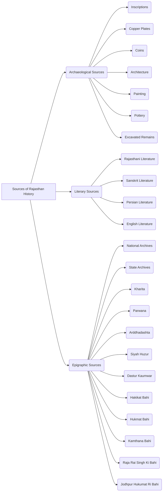

# Sources of Rajasthan History

There are three main categories of sources for studying the history of Rajasthan: Archaeological, Literary, and Epigraphic.

## I. Archaeological Sources

*   **Inscriptions:**
    *   The study of inscriptions is called Epigraphy.
    *   Inscriptions that praise kings are called *Prashasti* (eulogies).
    *   Inscriptions are contemporaneous (from the same time period).
    *   They help in determining chronological order.
    *   They provide information about genealogy, victories, and architecture.
        *   **(A) Badli Inscription (Ajmer, 443 BCE):**
            *   The oldest inscription in Rajasthan.
            *   Written in 'Veer Nirvan Samvat - 84'.
            *   Indicates that Madhyamika (Chittorgarh) was a Jain center.
            *   Discovered in 1912 by Gauri Shankar Hirachand Ojha at the 'Miroh Mata Temple'.
        *   **(B) Ghosundi Inscription (Chittorgarh, 2nd century BCE):**
            *   States that King Sarvatata of the Gaj dynasty performed the Ashwamedha Yagna.
            *   Provides information about the worship of Vasudeva and Sankarshana (Balarama).
            *   The oldest inscription in Rajasthan providing information about the Bhagavat or Vaishnava sect.
        *   **(C) Ranakpur Prashasti (1439 CE):**
            *   Located in the Chaumukha Temple (Adinath/Rishabhdev Temple).
            *   Distinguishes between Bappa Rawal and Kalbhoj as separate individuals.
            *   Provides information about the victories and titles of Krama.
            *   Uses the term 'Nanak' for currency.
            *   Mentions 'Depak' as the architect of the temple.
        *   **(D) Amer Inscription (1612 CE):**
            *   Written in Sanskrit and Nagari script.
            *   Calls the Kachhwaha (Kushwaha) clan 'Raghuvansh Tilak'.
            *   States that Jagat Singh was the son of Bhagwandas and built a fort at Jagnathagarh (Jaipur).
        *   **(E) Persian Inscription of Ajmer (1200 CE):**
             *  The first Persian inscription in Rajasthan.
            *   Located in the 'Adhai Din Ka Jhopda'.
            *   Indicates that a Sanskrit school was demolished to build a mosque.
        *   **(F) Persian Inscription of Chittorgarh (1325 CE):**
            *   Located in the 'Dharani Peer ki Dargah'.
            *   Gives the name of Chittorgarh as 'Khizrabad'.
*   **Copper Plates (Tamra Patra):**
    *   Issued for land grants.
        *   **(A) Ahar Copper Plate (1206 CE):**
            *   Provides information about the Chalukya King Bhim II of Gujarat.
        *   **(B) Kheroda Copper Plate (1437 CE):**
            *   States that Rana Kumbha donated land near Eklingji.
            *   Provides information about religious status, routes, and currency.
        *   **(C) Chikli Copper Plate (1483 CE):**
            *   Provides information about the taxation system.
        *   **(D) Pur Copper Plate (1535 CE):**
             * Provides information about Rani Karmavati's Jauhar (self-immolation).

*   **Coins:**
    *   The study of coins is called Numismatics.
    *   Various types of coins have been found at different places in Rajasthan.
        *   **(i) Nagar (Tonk):**
            *   6000 coins of the Malava Janapada were discovered by Carlleyle in 1871.
            *  Carlleyle is known as the "Father of Archaeology of Rajasthan".
        *   **(ii) Noh (Bharatpur):**
             * 1931 Gupta coins known as 'Garuda' type were found.
        *   The 'Gadhia' coins were prevalent in Rajasthan during the 10th-11th centuries.
        *  Later, different princely states of Rajasthan issued their own coins.
    *   **Princely States and Their Coins:**
        *   Mewar: Swaroopshahi (Silver)
        *   Marwar: Vijayshahi
        *   Bikaner: Gajshahi
        *   Amer: Jhadshahi
        *   Jaisalmer: Akheshahi (Akha/Abhay)
        *   Bundi: Ramshahi
        *   Kota: Gumanshahi
        *   Alwar: Raoshahi
        *   Dholpur: Tamanchashahi
        *   Dungarpur: Udayshahi
        *   Banswara: Salimsahi
        *   Pratapgarh: Salimsahi

*   **Architecture:**
    *   **Sheetleshwar Temple (Jhalrapatan):**
        *   A Gupta-era Shiva temple.
        *   The oldest Trimurti temple in Rajasthan (689 CE).
    *   **Jagatsiromani Temple (Amer):**
        *   An example of 'Mughal-Rajput' architecture.
        *   Built by Man Singh's queen, Kanakavati, in memory of her son Jagat Singh.
        *   The temple houses the same idol of Lord Krishna that Mirabai worshipped in Chittorgarh.

*   **Painting:**
    *   Rock paintings depicting hunting scenes have been found in various places.
    *   Most rock paintings are found in the Chambal and Chhaja (Bundi) river areas.
    *   Notable places include Alaniya (Kota), Kanyadah (Baran), Gararda (Bundi), Bairath (Jaipur), Sodapura (Sikar), Dadikar and Harsaura (Alwar).
    *   Jagat Narayan discovered these rock paintings.
    *   Ancient illustrated manuscripts are kept in the 'Vishnupuri Suri Bhandar' in Jaisalmer, such as *Odh Nivritti Vritti* and *Das Vaikalika Sutra Churni*.
     *  Different schools of painting developed in the princely states over time.
       *   Bundi School of Painting: Depiction of nature.
       *   Kishangarh School of Painting: Depiction of feminine beauty.
       *   Nathdwara School of Painting: Pichwai (religious tapestry)

*   **Pottery (Mrittika):**
    *   Pottery provides information about religious practices, dance, and musical instruments.

*   **Excavated Remains:**
   *  Excavations have been done at various sites in Rajasthan, revealing different materials.
      *  **Key Excavators:**
           * Tirath Nath Mishra
           * Ratna Chandra Agarwal
           * B. B. Lal
           * D. R. Bhandarkar
           * Lalit Pandey
           * Avin Singh Khakhtal
      *   **Excavated Sites:**
          *   Ahar
          *   Kalibanga
          *   Bairath
          *   Madhyamika (Nagari)
      *  **Materials Found:**
          *   Pottery
          *   Jewellery
          *   Coins
          *   Sculptures

*   **Vijay Stambh/Kirti Stambh:**
    *   A nine-story structure in the Chittorgarh fort.
    *   Known as the "Museum of Sculptures."
    *  Also known as the 'Encyclopedia of Indian Sculpture'.

## II. Literary Sources

*   **Rajastani Literature:**
    *   **(A) Muhnot Nainsi:**
        *   He was the Diwan (Finance Minister) of Maharaja Jaswant Singh of Jodhpur.
        *   **Books:**
            *   *(i) Marwar ra Pargana ri Vigat:*
                *   Provides information about the census.
                *   Called the 'Gazette of Marwar'.
                *   Provides information about administrative, social, and economic conditions.
            *   *(ii) Nainsi ri Khyat:*
                *   Provides information about the political history of Marwar.
                *   Gives information about Rajput history after the 17th century.
                *   Nainsi and his brother Sundardas were arrested on charges by Akbar, and they committed suicide in jail.
                *   Munshi Devi Prasad called Nainsi the 'Abul Fazal of the Rajputs'.
                *   Kalika Ranjan Kanungo considered Nainsi superior to Abul Fazal.
    *   **(B) Prithviraj Rathore:**
        *   Younger brother of Maharaja Rai Singh of Bikaner.
        *   A court scholar of Akbar.
        *   Akbar gave him the Gagron Fort.
        *   **Book:** *Veli Kishan Rukmani ri*
        *   **Poetic Style:** Dingal
        *   **Language:** Northern Marwari
        *   Dursa Ada called the book the 5th Veda and the 19th Purana.
        *   Tessitori called the book "the power of 10,000 horses."
        *   L.P. Tessitori called Prithviraj Rathore the "Heros of Dingal."

*   **Sanskrit Literature:**
    *   **(A) Jayanaka:**
        *   A court scholar of Prithviraj Chauhan.
        *   **Book:** *Prithviraj Vijaya*
        *   Provides information about the First Battle of Tarain.
    *   **(B) Mandan:**
        *   Architect of Rana Kumbha.
        *   **Book:** *Rajvallabh*
        *   Contains 14 chapters.
        *   Provides information about the architecture of villages, towns, forts, palaces, temples, and markets.

*   **Persian Literature:**
    *   **(A) Amir Khusro:**
        *   **Book:** *Tarikh-i-Alai/ Khazain-ul-Futuh*
        *   Provides information about Alauddin Khilji's invasions of Rajasthan.
    *   **(B) Abul Fazal:**
        *   **Book:** *Akbarnama (Ain-i-Akbari)*
        *   Describes the relationship between Pratap and Akbar.
        *   Provides information about the geographical locations of Mewar, Jaipur, Alwar, and Bharatpur.
        *   Provides information about the climate of Ajmer, Rajasthan's attire, festivals, and currency.

*   **English Literature:**
    *   **George Thomas:**
        *   From Ireland.
        *   A *Bhardauti* (mercenary) general of the Marathas.
        *   Attacked Jaipur, Udaipur, and Bikaner.
        *   First used the word 'Rajputana' for Rajasthan.
        *  **Book:** William Franklin's *Military Memoirs of George Thomas*.

    *   **James Tod:**
        *   From Scotland.
        *   A Political Agent of the British in Rajasthan.
        *   **Guru:** Yati Gyanchandra.
        *   **Books:**
            *   1. *Annals and Antiquities of Rajasthan or Central and Western Rajput States of India.*
            *   2. *Travels in Western India*.
        *   Considered the 'Father of Rajasthan History'.
        *   First to use the word 'Rajasthan'.
    *   **L.P. Tessitori:**
        *   From Italy (Italo).
        *   A linguist and archaeologist.
        *   **Guru:** Dharma Vijay Suri
        *   **Books:**
             *1) *Bardic and Historical Survey of Rajputana.*
            * 2) *Notes on Grammar of old western Rajasthani.*

## III. Epigraphic Sources

*   **National Archives:** Delhi.
*   **State Archives:** Bikaner.
*   **Kharita:** A letter from a king to another king.
*   **Parwana:** A letter from a king to his subordinates.
*   **Arddashta:** A letter from a subject to the king.
*   **Siyah Huzur:**  Related to the Jaipur state; recorded the daily expenses of the royal family.
*   **Dastur Kaumwar:**  Related to the Jaipur state; recorded the names and castes of the employees.
*   **Haqiqat Bahi:** Recorded the daily routine of the king.
*  **Hukumat Bahi:** Recorded government orders.
*   **Kamthana Bahi:** Recorded information about construction work.
*   **Raja Rai Singh ki Bahi:** The oldest *bahi* in Rajasthan, which contains information about the Mewar state.
*   **Jodhpur Hukumat Ri Bahi:** The second oldest *bahi* in Rajasthan, providing information about the reign of Maharaja Jaswant Singh of Jodhpur.

# Sources of Rajasthan History

Here's a breakdown of the sources of Rajasthan history, organized for clarity:

## I. Archaeological Sources

These sources provide tangible evidence of the past.

### 1. Inscriptions (Abhilekh)

*   **Epigraphy:** The study of inscriptions.
*   **Prashasti:** Inscriptions that praise kings.
*   **Contemporaneous:** Inscriptions are contemporary to the events they describe.
*   **Chronology:** Help in determining dates.
*   **Information:** Provide insights into genealogy, victories, and architecture.

**Important Inscriptions:**

| Inscription             | Location          | Date (approx.) | Key Information                                                                                                                              |
| :---------------------- | :---------------- | :------------- | :----------------------------------------------------------------------------------------------------------------------------------------- |
| **Badli Inscription**   | Ajmer             | 443 BCE        | Oldest inscription of Rajasthan, mentions 'Veer Nirvan Samvat-84',  identifies Madhyamika (Chittorgarh) as a Jain center, found at Miroh Mata Temple.  |
| **Ghosundi Inscription**| Chittorgarh      | 2nd century BCE| Mentions king Sarvatat of Gajavansh performing Ashwamedha Yagna, provides information about the worship of Vasudeva and Sankarshana (Balarama) - the oldest evidence of  Bhagavat/Vaishnav sect in Rajasthan.|
| **Ranakpur Prashasti**  | Ranakpur Temple    | 1439 CE        | Located in Chaumukha Temple (Adinath/Rishabhdev), differentiates Bapa Rawal and Kalbhoj, describes victories and titles of Krama, uses 'Nanak' for currency, mentions architect 'Deepak'.  |
| **Amer Inscription**    | Amer (Jaipur)    | 1612 CE        | In Sanskrit and Nagari script, calls Kachhawahas (Kushwahas) 'Raghuwansh Tilak', states that Jagatsingh was the son of Bhagwandas, and that he built a fort in Jagnathagarh.                                      |
| **Ajmer Persian Inscription**| Ajmer            | ~1200 CE       | First Persian inscription in Rajasthan, located in 'Adhai Din ka Jhopda', records a Sanskrit school being converted into a mosque.                          |
| **Chittorgarh Persian Inscription**| Chittorgarh    | 1325 CE        | Found at 'Dharani Pir ki Dargah', gives the name of Chittorgarh as "Khizraabad"                                                      |

### 2. Copper Plates (Tamra Patra)

*   Used for land grants.

**Important Copper Plates:**

| Copper Plate      | Location | Date (Approx.) | Key Information                                                                                                                   |
| :------------------ | :------- | :------------- | :---------------------------------------------------------------------------------------------------------------------------------- |
| **Ahar Copper Plate** | Ahar     | 1206 CE        | Provides information about Chalukya King Bhim II of Gujarat.                                                                   |
| **Kheroda Copper Plate** | Kheroda | 1437 CE        | Records land grant by Rana Kumbha near Eklingji temple, provides information about religious situation, routes and currency.     |
| **Chikali Copper Plate**| Chikali | 1483 CE        | Provides information about the tax system.                                                                                           |
| **Pur Copper Plate**  | Pur     | 1535 CE        | Provides information about Rani Karmavati's jauhar (self-immolation).                                                                  |

### 3. Coins (Sikke)

*   **Numismatics:** The study of coins.
*   Different types of coins found in various places of Rajasthan.

**Coin Discoveries and Types:**

| Place       | Discovery                                          | Details                                                                                                       |
| :---------- | :------------------------------------------------- | :------------------------------------------------------------------------------------------------------------ |
| **Nagar (Tonk)** | 6000 coins of Malav Janpad (1871 CE, Carlyle)  |  Malwa region of MP/PB, Carlyle considered the 'father of archaeology in Rajasthan'.                          |
| **Noh (Bharatpur)** | Gupta coins (1931)                             | 'Garuda' type coins.                                                                                          |
| **General** | 'Gadhiya' coins were prevalent in 10th-11th Century.     | Different princely states issued their own coins.                                                                   |

**Princely State Coins:**

| Princely State | Coins                 |
| :-------------- | :--------------------- |
| Mewar         | Swaroopshahi (Silver)  |
| Marwar        | Vijayshahi            |
| Bikaner       | Gajshahi              |
| Amer           | Jhadshahi              |
| Jaisalmer      | Akheshahi             |
| Bundi         | Ramshahi              |
| Kota          | Gumanshahi             |
| Alwar          | Raoshahi              |
| Dholpur       | Tamanchashahi          |
| Dungarpur      | Udayshahi             |
| Banswara      | Salimshahi             |
| Pratapgarh    | Salimshahi             |

### 4. Architecture (Sthapatya Kala)

*   Examples provide insight into building styles and religious practices.

**Notable Structures:**

| Structure                        | Location         | Details                                                                                                                                     |
| :------------------------------- | :--------------- | :------------------------------------------------------------------------------------------------------------------------------------------ |
| **Sheetleshwar Temple**           | Jhalrapatan       | Gupta-era Shiva temple, oldest Trimurti temple in Rajasthan.                                                                                |
| **Jagat Shiromani Temple** | Amer             | Example of 'Mughal-Rajput' architecture, built by Queen Kankavati in memory of her son Jagatsingh, houses the same idol of Krishna that Meera Bai worshipped in Chittorgarh.  |

### 5. Painting (Chitrakala)

*   Rock paintings and illustrated manuscripts provide information about daily life, religious beliefs, and artistic styles.

**Key Aspects:**

*   Rock paintings, often depicting hunting scenes, found in areas near Chambal and Chaja rivers.
*  **Notable locations for rock art:** Alaniya (Kota), Kanyadeh (Baran), Gardada (Bundi), Bairath (Jaipur), Sodapura (Sikar), Dadikar and Harsora (Alwar).
*    **Jagtanarayan:**  Credited for discovering rock paintings.
*   Ancient illustrated manuscripts are preserved in 'Vishnupuri Suri Bhandar' in Jaisalmer.
*   Different styles of painting developed in various princely states.

**Painting Styles:**

| Style                | Key Features                  |
| :-------------------- | :--------------------------- |
| Bundi School        | Nature depiction             |
| Kishangarh School | Female beauty                  |
| Nathdwara School   | Pichwai (backdrop) paintings  |

### 6. Pottery (Mrittika)

*   Pottery provides insights into religious beliefs, dance, and musical instruments.

### 7. Excavated Remains (Utkhanit Puravashesh)

*   Artifacts discovered during excavations at various sites provide a wealth of information.

**Key sites and Excavators:**

| Place     | Material Recovered | Excavators                                                                      |
| :-------- | :----------------- | :------------------------------------------------------------------------------ |
| Ahar       | Pottery, ornaments, coins, sculptures                 | Tirth Nath Mishra, Ratan Chandra Agarwal              |
| Kalibanga   |                     | B. B. Lal                                                                        |
| Bairath   |                     | D. R. Bhandarkar                                                              |
| Madhyamika (Nagari) |               | Lalit Pandey, Avin Singh Khakhtal                                            |

## II. Literary Sources

### 1. Rajasthani Literature

*   Works in Rajasthani language providing historical, social, and cultural insights.

**(A) Muhnot Nainsi**

*   Diwan (Finance Minister) of Jodhpur Maharaja Jaswant Singh.
    *   **(i) Marwar ra Pargana ri Vigat:**
        *   Provides census information.
        *   Known as 'Gazetteer of Marwar'.
        *   Offers details about administrative, social, and economic conditions.
    *   **(ii) Nainsi ri Khyat:**
        *   Provides information about political history of Marwar.
        *   Details Rajput history after the 17th century.
        *   Nainsi and his brother were arrested under Akbar's orders, and committed suicide in jail.
        *   **Munshi Deviprasad:** Called Nainsi "Abul Fazal of Rajputs".
        *  **Kalika Ranjan Kanungo:** Considered Nainsi superior to Abul Fazal.

**(B) Prithviraj Rathore**

*   Younger brother of Bikaner Maharaja Raisingh.
*   Court scholar of Akbar.
*   Given the fort of Gagron by Akbar.
*    **Book:** *Veli Kishen Rukmani ri*
    *   **Poetic Style:** Dingal.
    *   **Language:** Northern Marwari.
    *   **Dursa Adha:** Called the book the 5th Veda and 19th Puran.
    *  **L.P. Tessitori:** Called the book "Power of 10,000 Horses" and termed Prithviraj Rathore "Hero of Dingal".

### 2. Sanskrit Literature

**(A) Jayanaka**

*   Court scholar of Prithviraj Chauhan.
*   **Book:** *Prithviraj Vijay*
*   Provides information about the first battle of Tarain.

**(B) Mandan**

*   Architect of Rana Kumbha.
*  **Book:** *Rajvallabh*
    *   Has 14 chapters.
    *  Provides information about architecture of villages, cities, forts, palaces, temples, and markets.

### 3. Persian Literature

**(A) Amir Khusrau**

*   **Book:** *Tarikh-e-Allai / Khazain-ul-Futuh*
*   Provides information about Alauddin Khalji's invasions of Rajasthan.

**(B) Abul Fazal**

*   **Book:** *Akbarnama* (includes *Ain-i-Akbari*)
*   Details relations between Pratap and Akbar.
*   Describes the geography of Mewar, Jaipur, Alwar, and Bharatpur.
*   Provides insights into the climate of Ajmer, and clothing and festivals of Rajasthan.

### 4. English Literature

*   Works by British officials, travelers, and scholars.

**(A) George Thomas**

*   Irish.
*   Maratha mercenary.
*   Attacked Jaipur, Udaipur, and Bikaner.
*   First to use the term "Rajputana" for Rajasthan.
*    **Book:** *Military Memoirs of George Thomas* by William Franklin.

**(B) James Tod**

*   Scottish.
*   Political Agent of the British in Rajasthan.
*   **Guru:** Yati Gyan Chandra.
*   **Books:**
    1.  *Annals and Antiquities of Rajasthan* (or *Central and Western Rajput States of India*).
    2. *Travels in Western India.*
*   Known as the 'father of Rajasthan history'.
*   First to use the term "Rajasthan" for this region.

**(C) L.P. Tessitori**

*   Italian.
*   Linguist and archaeologist.
*   **Guru:** Dharma Vijay Suri.
*   **Books:**
    1.  *Bardic and Historical Survey of Rajputana*.
    2. *Notes on Grammar of old western Rajasthani.*

## III.  Archival Sources

*   Documents preserved in national and state archives.

**Key Archives:**

*   National Archives - Delhi
*   State Archives - Bikaner

**Types of Documents:**

| Document Type   | Description                                                            |
| :-------------- | :--------------------------------------------------------------------- |
| **Kharita**     | Letters written by one king to another.                                |
| **Parwana**     | Letters written by a king to his subordinates.                      |
| **Arddashta**  | Letters written by the public to the king.                             |
| **Siyah Huzur**  | Documents related to the Jaipur state, details daily expenses of the royal family. |
| **Dastur Kaumwar**| Documents related to the Jaipur state, lists the names and castes of employees.|
| **Haqiqat Bahi** | Record of the king's daily routine.                                 |
| **Hukumat Bahi**  | Record of government orders.                                     |
| **Kamthana Bahi**| Record of construction activities.                                    |
| **Raja Raisingh ki Bahi** | Oldest 'bahi' from Rajasthan, gives information about Mewar.                                   |
| **Jodhpur Hukumat ri Bahi** | Second oldest 'bahi' from Rajasthan, records the reign of Jodhpur Maharaja Jaswant Singh. |

Okay, here's a structured and translated version of your Rajasthan history notes, formatted in markdown with tables and a simple diagram.

# Sources of Rajasthan History

Rajasthan's history is pieced together from various sources: Archaeological, Literary, and Epigraphic.

## I. Archaeological Sources

These provide tangible evidence of the past.

*   **Inscriptions (Abhilekh)**
*   **Copper Plates (Tamra Patra)**
*   **Coins (Sikke)**
*   **Architecture (Sthapatya Kala)**
*   **Painting (Chitrakala)**
*   **Pottery (Mrittika)**
*   **Excavated Remains (Utkhanit Puravashesh)**

### (i) Inscriptions (Abhilekh)

*   The study of inscriptions is called **Epigraphy**.
*   Inscriptions that praise kings are called **Prashasti**.
*   Inscriptions are **contemporary** (of the time).
*   They help in determining the **chronology** of events.
*   They provide information about **genealogy**, **victories**, and **architecture**.

#### Key Inscriptions:

| Inscription Name                    | Location    | Time Period      | Key Information                                                                                                                                                                                                                                               |
| :---------------------------------- | :---------- | :--------------- | :------------------------------------------------------------------------------------------------------------------------------------------------------------------------------------------------------------------------------------------------------------ |
| **Badli Inscription**               | Ajmer       | 443 BCE          |   *Oldest inscription in Rajasthan*.    Written in "Veer Nirvan Samvat - 84".   Reveals Madhyamika (Chittorgarh) as a Jain center.   Found in 1912 by Gauri Shankar Hirachand Ojha at Miroh Mata Temple.                                          |
| **Ghosundi Inscription**            | Chittorgarh | 2nd Century BCE  |   Mentions King Sarvatata of the Gaj dynasty performing the Ashwamedha Yagya.  Provides information about the worship of Vasudeva and Sankarshana (Balram).    Oldest inscription in Rajasthan providing details of the "Bhagavat or Vaishnav" sect. |
| **Ranakpur Prashasti**              | Ranakpur    | 1439 CE          |   Located in the Chaumukha Temple (Adinath/Rishabhdev).  Distinguishes between Bappa Rawal and Kalbhoj.    Provides information on the victories and titles of Krama.    Uses the word 'Nanak' for currency.   Mentions the architect 'Depak'. |
| **Amer Inscription**                | Amer        | 1612 CE          |   In Sanskrit and Nagari script.   Refers to the Kachhwaha (Kushwaha) clan as 'Raghu Vansh Tilak'.    States that Jagat Singh was the son of Bhagwandas and built a fort at Jagnathagarh (Jaipur).                                                   |
| **Ajmer Persian Inscription**       | Ajmer       | 1200 CE (approx) |    First Persian inscription in Rajasthan.    Located in the 'Adhai Din ka Jhopra'.   States that a Sanskrit school was demolished and a mosque was built in its place.                                                                              |
| **Chittorgarh Persian Inscription** | Chittorgarh | 1325 CE          |   Located in the "Dharani Pir ki Dargah".    Refers to Chittorgarh as "Khizrabad".                                                                                                                                                                      |

### (ii) Copper Plates (Tamra Patra)

*   Issued for **land grants**.

| Copper Plate Name      | Location/Issuer        | Time Period | Key Information                                                                                                        |
| :--------------------- | :--------------------- | :---------- | :-------------------------------------------------------------------------------------------------------------------- |
| **Ahar Copper Plate**  | Ahar/Chalukya King Bhim II  | 1206 CE     | Provides information about the Chalukya King Bhim II of Gujarat.                                                                                |
| **Kheroda Copper Plate**|  Rana Kumbha          | 1437 CE     | Documents land grant to Eklingji.   Provides insights into religious conditions, routes, and currency.                                                  |
| **Chikli Copper Plate** |                        | 1483 CE     | Provides information about the tax system.                                                                                                |
| **Pur Copper Plate**    |  Queen Karmavati      | 1535 CE     | Documents the Jauhar of Queen Karmavati.                                                                              |

### (iii) Coins (Sikke)

*   The study of coins is called **Numismatics**.
*   Various types of coins have been found in Rajasthan.

#### Key Coin Discoveries & Information

| Location         | Time Period     | Type/Information                                                                          |
| :--------------- | :-------------- | :---------------------------------------------------------------------------------------- |
| **Nagar (Tonk)** |  1871 CE      |   6000 coins of the Malav Janapada found by Carlleyle. [Malwa- M.P./PB]     *Note: Carlleyle is considered the "Father of Archaeology of Rajasthan."*|
| **Noh (Bharatpur)** | 1931 CE | Gupta coins called 'Garuda' type.                                                                  |
| **General**| 10-11th Century  | 'Gadhia' coins were prevalent in Rajasthan.                                                  |
| **Later period**|Various periods | Different princely states of Rajasthan issued their own coins.                         |

#### Coins of Princely States

| State      | Coin Name      | Metal   |
| :--------- | :------------- | :------ |
| Mewar      | Swaroopshahi    | Silver  |
| Marwar     | Vijayshahi     |         |
| Bikaner    | Gajshahi       |         |
| Amer       | Jhadshahi      |         |
| Jaisalmer  | Akheysahi     |         |
| Bundi      | Ramshahi       |         |
| Kota       | Gumanshahi     |         |
| Alwar      | Raoshahi       |         |
| Dholpur   | Tamanchashahi |         |
| Dungarpur  | Udayshahi     |         |
| Banswara   | Salimsahi      |         |
| Pratapgarh | Salimsahi      |         |

### (iv) Architecture (Sthapatya Kala)

*   **Sheetaleshwar Temple (Jhalarapatan):** A Gupta-era Shiva temple. Oldest Trimurti temple in Rajasthan (689 CE).
*   **Jagath Shiromani Temple (Amer):** Example of 'Mughal Rajput' architecture. Built by Queen Kankavati in memory of her son Jagat Singh. It has the same Krishna idol that Mirabai used to worship in Chittor.

### (v) Painting (Chitrakala)

*   Rock paintings depicting hunting scenes are found in various parts of Rajasthan.
*   Concentrated areas: Chambal and Chhaja river regions (Bundi).
*   Key locations: Alaneya (Kota), Kanyadah (Baran), Gararda (Bundi), Bairath (Jaipur), Sodapura (Sikar), Dadikar & Harsora (Alwar).
*   Jagatnarayan discovered the rock paintings.
*   Ancient illustrated texts are preserved in 'Vishnupuri Suri Bhandar' in Jaisalmer (e.g., *Odh Nivritti Vritti*, *Das Vaikalika Sutra Churni*).
*   Different styles of painting developed in various princely states.
    *   Bundi Style: Nature
    *   Kishangarh Style: Feminine Beauty
    *   Nathdwara Style: Pichwai (Textile Backdrop).

### (vi) Pottery (Mrittika)

*   Provides information about religious practices, dance, and musical instruments.

### (vii) Excavated Remains (Utkhanit Puravashesh)

*   Various excavations have yielded diverse artifacts.

| Site      | Artifacts/Information                                             |
| :-------- | :---------------------------------------------------------------- |
| Ahar      | Pottery, jewelry, coins, idols.                           |
| Kalibanga | Pottery, jewelry, coins, idols.                           |
| Bairath    | Pottery, jewelry, coins, idols.                          |
| Madhyamika (Nagli)     | Pottery, jewelry, coins, idols.                     |

**Key Archaeologists:** Teerth Nath Mishra, Ratna Chandra Agarwal, B.B. Lal, D.R. Bhandarkar, Lalit Pandey, Avin Singh Khakhtal.

## II. Literary Sources

These provide written accounts of the past.

### (i) Rajasthani Literature

*   **Muhnot Nainsi:** Diwan of Jodhpur Maharaja Jaswant Singh.
    *   **Books:**
        *   ***Marwar Ra Pargana Ri Vigat:*** Provides census information and known as "Gazetteer of Marwar". Details on administrative, social and economic conditions.
        *   ***Nainsi Ri Khyat:*** Contains the political history of Marwar.  Provides Rajput history after the 17th century.  Nainsi and his brother Sundardas were arrested and committed suicide in prison.  Munshi Deviprasad called Nainsi the 'Abul Fazl of the Rajputs'.
        *   Kalika Ranjan Kanoongo called Nainsi superior to Abul Fazl.
*  **Prithviraj Rathore**: Younger brother of Bikaner Maharaja Raisinh. A court scholar of Akbar. Akbar gave him the Gagron fort.
     * Book: *Veli Kishan Rukmani Ri*.
     * Poetic Style: Dingal
     * Language: Northern Marwari
     * Dursa Adha called this book the 5th Veda and 19th Puran.
    * Tessitory described this book as having the strength of "10,000 horses".
     * L.P Tessitory called Prithviraj Rathore "Hero of Dingal".

### (ii) Sanskrit Literature

*   **Jayanak:** Court scholar of Prithviraj Chauhan.
    *   Book: ***Prithviraj Vijaya***. Information about the First Battle of Tarain.
*   **Mandan:** Architect of Rana Kumbha.
    *   Book: ***Rajavallabh*** (14 chapters). Provides information on the architecture of villages, towns, forts, palaces, temples, and markets.

### (iii) Persian Literature

*   **Amir Khusro:**
    *   Book: ***Tarikh-e-Alai/ Khazain-ul-Futuh.*** Provides information on the invasions of Rajasthan by Alauddin Khilji.
*   **Abul Fazl:**
    *   Book: ***Akbarnama (Ain-i-Akbari)***.  Describes the relations between Pratap and Akbar.  Contains details on the geography of Mewar, Jaipur, Alwar, and Bharatpur. Also provides information on climate of Ajmer, dress and festivals of Rajasthan and currency.

### (iv) English Literature

*   **George Thomas:** An Irish military commander. Maraatha mercenary.  Attacked Jaipur, Udaipur, and Bikaner. First used the term 'Rajputana' for Rajasthan.
    *   William Franklin’s book: ***Military Memoirs of George Thomas***.
*   **James Tod:** Scottish Political Agent of the British. Guru - Yati Gyanchandra.
    *   Books: *Annals and Antiquities of Rajasthan or Central and Western Rajput States of India.*  *Travels in Western India.* He is considered the 'Father of Rajasthan History'. First used the term Rajasthan.
*   **L.P. Tessitori:** An Italian philologist and archaeologist. Guru- Dharma Vijay Suri.
    *   Books: *Bardic and Historical Survey of Rajputana.*  *Notes on Grammar of Old Western Rajasthani*.

## III. Epigraphic Sources

*   **National Archives:** Delhi
*   **State Archives:** Bikaner
*   **Kharita:** A letter from one king to another.
*   **Parwana:** A letter from the king to his subordinates.
*  **Arddhadashta:** A letter written by citizens to king
*   **Siyah Huzur:** Related to the Jaipur state. Records daily expenses of the royal family.
*   **Dastur Kaumwar:** Also related to Jaipur state.  Lists names of employees and their caste.
*   **Hakikat Bahi:** Record of the daily routine of the king.
*  **Hukmat Bahi:** Contains the government orders.
*   **Kamthana Bahi:** Contains the information about the construction works.
*   **Raja Rai Singh Ki Bahi:** Oldest Bahi of Rajasthan with information about Mewar.
*  **Jodhpur Hukumat Ri Bahi:** Second oldest Bahi of Rajasthan, containing details of the reign of Jodhpur Maharaja Jaswant Singh.

---
##  Simple Diagram of Source Types:

This markdown provides a clear, organized, and translated version of the provided notes. Tables help with quick reference, and the mermaid diagram summarizes the sources in a visually understandable way.
